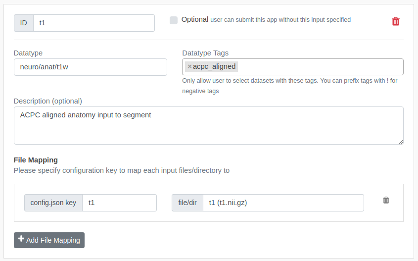
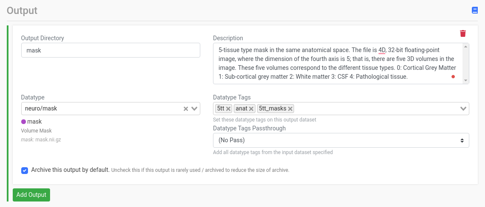
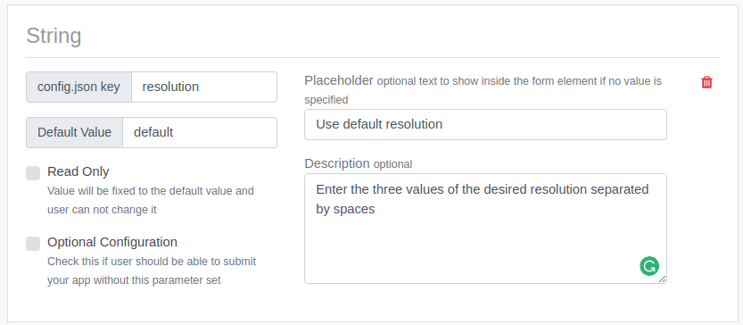
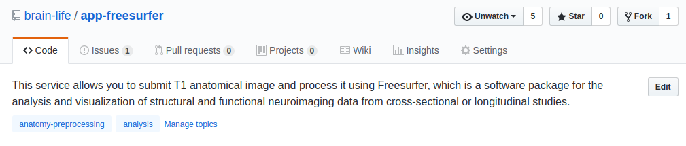
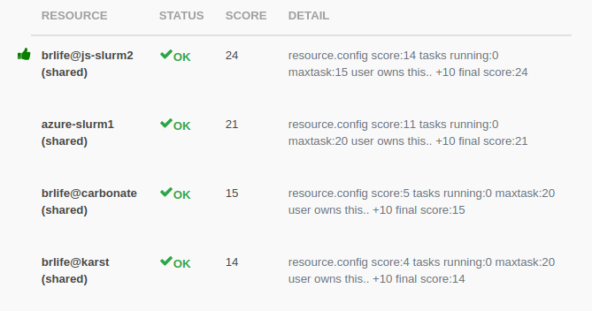

# Registering App

Once your App is published on github, you can now register it on Brainlife and let you and other users discover your App and execute it on Brainlife.

First, go to the [Apps page](https://brainlife.io/apps) on Brainlife, click `Plus Button` at the bottom right corner of the page. App registration form should appear.

Let's go through each section.

## Detail


Enter any `name` for your App and `Git Repository Name` field which is the organization / repository name (like `yourname/app-name`) of your github repo. Please do not enter the full github URL.

All other fields in this section are optional, but you could populate the following fields.

### Avatar 

You can enter an `avatar` URL if you have an URL for an avatar that you'd like to use for your App. Please choose a square image with `https://` URL (not `http://`). Avatar may sound superfluous, but please keep in mind that there are many other Apps registered on Brainlife and this might be the only visual queue for users to identify and search for your App. If you don't specify the Avatar URL, Brainlife will use a randomly generated (robots) Avatar.

### Project

By default, all Apps are *public* meaning any user can find your App and execute your App. If you'd like to make your App only available on a specific project (and their group members), you can enter project names under the `Project` field and only the member of that project will be able to access your App. This might be useful if you are still developing your App and wants to keep it hidden until you make a formal *release*, or if your App would only function on data stored under a specific project.

### Branch

If you don't specify the github repo's branch name, it uses `master` branch by default. Most developer makes the latest code changes on `master` branch. If you leave the `Branch` field empty and let it use the `master` branch by default, a user won't be able to reproduce the output with exactly the same version of your code if you make any changes to it.

Once you finish developing your App, you should consider creating a release branch (like `1.0`) and specifying that branch name for your App so that Brainlife will always run the specific version of your App. Brainlife stores the branch name used to execute each task, so this allows users to reproduce the output using the same version of the code.

Please see [Versioning Tip](/docs/apps/versioning) for more info!

## Input Datasets

Here you can define a list of input data that your App is expecting.



### ID

This is just an ID to uniquely identify this input data. Please enter any ID you'd like to use. You can use this ID within config.json (._inputs) to find information about the input data at runtime.

### Datatype/Tags

The datatype/tags of this input data. Please enter any datatype tags that your App would require under the `Datatype Tags` field. Brainlife will only allow users to select data that meet specified datatype tags.

!!! hint
    If you don't know which datatype to use, please consult the #datatype slack channel on Brainlife slack team.

Please read [datatypes](/docs/user/datatypes) for more information. 

### File Mapping

Once you select the datatype/tags for your input data, you then need to configure how you want the selected data to be represented in the `config.json`. Each datatype consists of various files and directories. Here, you can map the object key in `config.json` to a particular file / directory within the datatype.

For example, `neuro/dwi` datatype consists of dwi, bvecs, and bvals files. If your App somehow only uses the dwi file, and if you'd like to receive the path to the dwi as `dwi` inside the `config.json`, you can configure it as follows.


When a user submits your App, it will generate `config.json` that looks like this

```json
{
    "dwi": "../path/to/dwi.nii.gz"
}
```

Your App can parse `config.json` and use the value for `dwi` as the file path pointing to the input dwi image.

!!! note
    If you want to use all 3 files from `neuro/dwi` datatype, you have to create 3 file mappings for each file; dwi, bvecs, and bvals.

### Optional

Click this to make this input data optional. Leave it unchecked if it's a required field. If you make it optional and the user doesn't provide the input, Brainlife will generate `config.json` without any keys defined in the File Mapping section.

### Multi

Click this if you'd like to allow users to select multiple input data. Selected data will be placed inside a json array. If the user selects only 1 data, it will still be placed inside a json array. For example, above `config.json` will be generated as the following.

```json
{
    "dwi": [
	"../path/to/dwi.nii.gz"
    ]
}
```

!!! note
    The index of the data listed in the array will be preserved across all File Mappings if there is more than 1 file mapping for this input.

## Output

Similar to the input data, you can specify the datatypes of your output data here. It's up to the developer to decide which datatype to use (please discuss new datatype under #datatype slack channel) and generate output files in the correct file structure / file names according to the specification of the datatype.



For example, with above configuration, App is expected to create an output directory called `mask` and store a file `mask.nii.gz` inside this directory.

Please be sure to enter as much description as possible so that users of your App know what they can do with the output from you App.

### Datatype Tags

You can add specificities / context to the selected datatype. For example, the above screenshot shows this App outputs `anat/t1w` datatype with a tag `acpc_aligned`. If there is an App that only works with ACPC aligned `anat/t1w` as an input data, it can specify the same tag as a required input datatype tag to be more specific about its input data. 

Please read [datatypes page](/docs/user/datatypes) for more information on datatypes.

### Tag Passthrough

Some Apps behave as a *filter*; they receive an input data and produce another data with the same datatype. In this circumstance, the App often needs to *add* new datatype tags rather than completely replacing them. To accomplish this, you can set this field to the ID of the input data that you'd like to copy all datatype tags from. For example, if the input data contains the `defaced` datatype tag,  the output data will have both `acpc_aligned` and `defaced` as the output datatype tags.

### **raw** datatype

Your App may generate output data that is not meant to be used by any other Apps, at least initially. You can use `raw` datatype to output and archive such output data. You should avoid using `raw` datatype as an input datatype, however. If you are trying to use other App's `raw` data as your input data, it is probably a good indication that the upstream App developer and you should discuss and define a new datatype so that both Apps can interoperate through a well-defined datatype.

Please contact the other developer and discuss how the data should be structured, and submit a new issue on [brain-life/datatypes](https://github.com/brain-life/datatypes/issues) and/or a pull request containing the list of files/directories to be registered on Brainlife.

## Configuration Parameters

Configuration parameters allow users to enter any `number` (integer/float), `boolean`(true/false) or `string` parameters as configuration parameters for your App. You can also define an `enum` parameter which lets users select from multiple options.



* **Placeholder** 

    For each input parameter, you can set a *placeholder* (a string displayed inside the form element if no value is entered yet). For example, you could use a placeholder to let the user know the format of the values, or some samples.

* **Description**

    Some configuration parameters let you specify a description which will be displayed next to the input parameter to show detailed explanation for the input parameter. Please provide enough details for both novice and experienced users of your App.

    !!! note
        ** For Novice Users **

        Brainlife is a platform for both novice and experienced users. For novice user, please add enough details for each configuration parameter and instruction about how to find a correct values to set for each parameters (a link to other webpage, point to README, etc.)
 
        Please make as many parameters optional as possible, and auto-detect the optimal values at runtime if user does not provide/override the default option.

        ** For Experienced Users **
        
        At the same time, your App should not become a blackbox for experienced users. You should allow them to choose/override any parameters and allow them to be fully in control of how the algorithm works. 

Finally, click `Submit`. Visit the Apps page to make sure everything looks OK.

## README / Description / Topics

Brainlife re-uses information stored in github repo.

* App Description / Topics

    Your Github repo description is used to display Brainlife App description. Please be sure to enter a description that shows what the App does, and what user can do with the output. 
    
    Github topics are also used to organize Brainlife's Apps by placing them under various `categories`. Please look through the existing categories already registered in Brainlife, and reuse one or more of those categories to help users find your App more easily.

    

    !!! note
        Please avoid using too many `topics`. Also please avoid using `topics` that are not yet used by any other Apps (it will create a category with a single App)

* README.md

    Brainlife displays README.md content from your github repo. You can include any images, latex equations, or any other standard [markdown syntax](https://github.com/adam-p/markdown-here/wiki/Markdown-Cheatsheet).
    
    You should include information such as.

    * What your App does, and how it's implemented (tools, libraries used)
    * What your App produces and what users can do with it
    * Any diagrams / sample output images
    * Details on how the algorithm works
    * Computational cost / resources required to run your App (how long does it take to run, minimum required memory / cpu cores, etc..)
    * How can other users contribute (Are you accepting any PR?)
    * References to other published papers, or list of contributors.

    !!! note
        Brainlife is for both novice and experienced neuroscience researchers. Please try to cater for both groups of users.

## Enabling App on resource

Once you registered your App on Brainlife, you then need to enable your App on resources where you can run it. A resource could be any VM, HPC cluster, or public / private cloud resource. Only the resource owners/administrators can enable your App to run on their resources. Please contact the resource administrator for the resource where you'd like to submit your App.

!!! note
    If you are not sure who the resource administrator is, please contact [Brainlife](mailto:brlife@iu.edu).

If you have access to your own computing resources, you can register personal resources and run your App there to test. Please read [registering resource page](/docs/resources/register.md) for more detail. Please keep in mind that, on personal resources, only you can run enabled Apps on those resources. To allow other users to run your App, you will need to enable it on Brainlife's shared resources.

Once your App is enabled on various resources, you should be able to see them listed under the computing resources section on the App details page.



!!! note
    Your App is not ready to be run on Brainlife yet. To do so, you need first to containerize it, as explained in the next step of this tutorial [Containerizing App](https://test.brainlife.io/docs/apps/container/).
