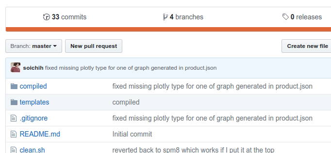

Although Brainlife does not require you to use any specific git branching schema and you should observe any standard practice from your own group, here are some guidelines that we suggest.

## Work on master branch

When you are updating your app, you should push the latest changes to the master while pulling from the remote master often to reduce merge conflict. You can/should use your local branches for each features you are working on, but don't push them to the remote. When you are done testing the new feature / bug fixes on your local branch, merge them to your local master, then push that to the origin master as frequently as possible.

## Test before pushing to master

Brainlife App can be tested on your laptop by executing `main`, or submitting it to HPC system by using `start` script if you have the [ABCD Hook](/docs/resources/register/#abcd-default-hooks) installed on your PATH. You should not commit / push your changes to github just to test the change you just made on Brainlife.

## Create a branch for new versions

When we are done with making all changes, and tested the master branch on Brainlife, you should create a new git branch from the master branch. You can easily create a new branch using github UI. 

Once you create a new release branch, you should update the BL app to point users to use that new branch.

You could use tags instead of branches, but tags do not allow you to make modifications if you need to make quick bug fixes. Tags are great to point to any particular commit point, but you can do that with just a plain commit ID. We recommend creating new branches for each release.

## Bug fix on release branch

If you find a critical bug after you create a branch, fix the bug on the master first, test it (both locally and on Brainlife), then apply the same fix on all branches that are affected by the bug. I recommend using a command like [cherry-pick](https://git-scm.com/docs/git-cherry-pick){target=_blank} to apply specific changes on other branches as you probably don't want to merge all other changes made to the master since the branch was created. We should not update branches other than some critical bug fixes to ensure the reproducibility of your App.

## Learn Semver

If you don't know what semantic versioning is, please read [https://semver.org/](https://semver.org/){target=_blank}.

For branch names, we should use major and minor versions (like "2.3"), but don't include the patch number, as patch numbers are incremented for each bug fixes and you don't need to create a new branch for each bug fixes. If you make non-backward compatible changes, you should consider registering a brand new Brainlife app with a different major version number so that the user can continue to submit your app with previous versions.
