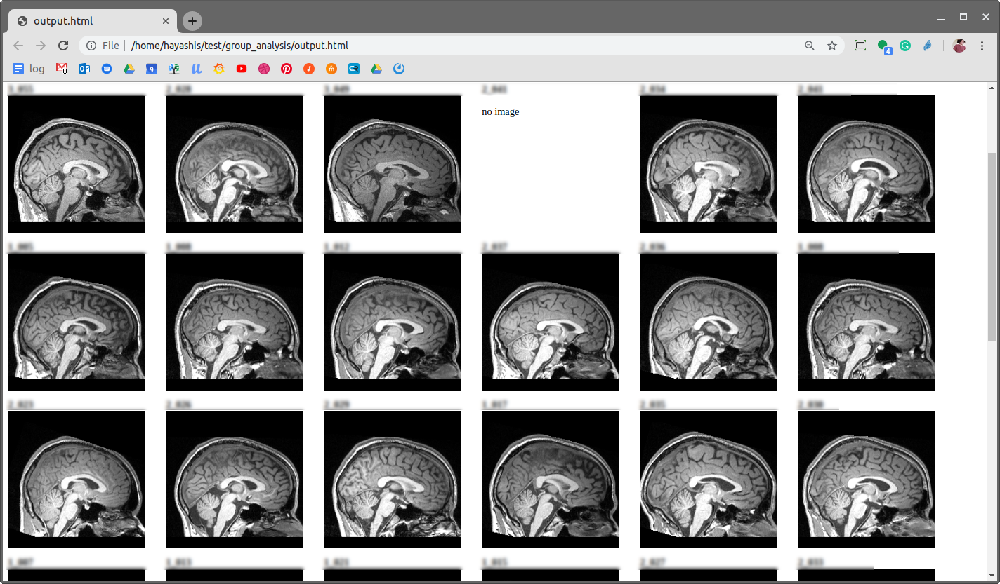

!!! warning
    This page has been deprecated. The information contained here would not work.

Once you are able to generate large amount of data derivatives on brainlife.io, your next step might involve performing data aggregation for group or statistical analysis. You can download all data derivatives to your computer and conduct any post-processing on your own computer, however, downloading all derivatives might take a long time, and consume a lot of disk space. If you are wanting to quickly explore results of your analysis, this might not be ideal.

Brainlife allows Apps to generate condensed (textual) version of output data and store them on brailife.io database. Similar to data-object metadata, you can query and/or download this information without having to download the raw data derivatives. This data is called `product.json`. For example, "Tract Profile Analysis" App (https://brainlife.io/app/59ca5c03c27f5b0770add9cf){target=_blank} generates the following `product.json`.

```json
{
    "profiles": {
        "forcepsMinor": {
            "ad": {
                "profile": [
                    1.3266,
                    1.318,
                    ...
                    1.3188,
                    1.3251
                ],
                "mean": 1.4605,
                "sd": 0.1479
            },
            "fa": {
                "profile": [
                    0.3648,
                    0.3619,
                    ...
                    0.3291,
                    0.3347
                ],
                "mean": 0.4918,
                "sd": 0.1284
            },
            "md": {
                "profile": [
                    0.9368,
                    0.9326,
                    ...
                    0.9588,
                    0.9582
                ],
                "mean": 0.9152,
                "sd": 0.0676
            },
            "rd": {
                "profile": [
                    0.742,
                    0.7399,
                    ...
                    0.7788,
                    0.7747
                ],
                "mean": 0.6426,
                "sd": 0.1203
            },
            "icvf": { ... },
            "isovf": { ...  }
        },
        "forcepsMajor": { ...  },
        "leftTPC": { ...  },
        "leftOccipitoCerebellar": { ...  }
    }
}
```

You can download the content of `product.json` with brainlife.io REST API. 

!!! note
    Please run `bl login` before running this example. You will also have to adjust the project / datatype IDs.

## Matlab Example

The following code downloads data-object records from brainlife so that you can then iterate through each record and examine meta data, or product contents.

```matlab

%define query
find = struct;
find.removed = false;
find.project = '5a74d1e26ed91402ce400cca'; %project id from brainlife.io
find.datatype = '5965467cb09297d8d81bdbcd'; %tractprofile datatype (find in datatypes page)
find.tags = {'wNODDI', '21600'};

%you can filter by subject
find.meta_dot_subject = struct('x_in',["103", "105"]);

%load brainlife access token
jwt = fileread('~/.config/brainlife.io/.jwt'); %use bl login to generate it
options = weboptions()
options.HeaderFields = {'Authorization', ['Bearer ', jwt]};
options.Timeout = 10; %could take a long time to load with a larger product..

%load data-objects
disp('Querying brainlife for data product...')
disp(find)
url = 'https://brainlife.io/api/warehouse/dataset';

%I have to do some matlab > mongo query conversion
find_json = strrep(jsonencode(find), 'x_', '$');
find_json = strrep(find_json, '_dot_', '.');
data = webread(url, 'find', find_json, 'select', 'product', 'limit', '1000', options);

%TODO ... do things with data.datasets
disp('loaded! - enjoy with data')
disp(data)

 
```

## Python Example

Similarly, you can query data-object records using python. 

```python
#!/usr/bin/python

import requests
import os
import json

#load the jwt token (run bl login to create this file)
jwt_file = open(os.environ['HOME']+'/.config/brainlife.io/.jwt', mode='r')
jwt = jwt_file.read()

#query datasets records
find = { 
	'datatype': '58c33bcee13a50849b25879a', 
	'project': '5cb8973c71a8630036207a6a',
	'tags': 'acpc_aligned' }
params = { 
	'limit': 100, 
	'select': 'product meta', #we just want product and meta
	'find': json.JSONEncoder().encode(find) }
res = requests.get('https://brainlife.io/api/warehouse/dataset/', params=params, headers={'Authorization': 'Bearer '+jwt})
if res.status_code != 200:
	raise Error("failed to download datasets list")

```

As you can see, you can construct your query and make a request to brainlife API with your access token issued by running `bl login`. Once you obtain the dataset records (`res`) you can iterate through each dataset and do any group analysis, or generate visualization using the content of meta and product objects.

For example, the following code shows how to convert the QC images from ACPC Alignment App into a single HTML page.


```python

#load product.json for each dataset
data = res.json()
for dataset in data["datasets"]:
    id = dataset["_id"]
    subject = dataset["meta"]["subject"]
    print('<div style="float: left; height: 250px; width: 250px;">');
    print("<b>"+subject+"</b><br>")

    res = requests.get('https://brainlife.io/api/warehouse/dataset/product/'+dataset["_id"], headers={'Authorization': 'Bearer '+jwt})
    if res.status_code != 200:
        raise Error("failed to download product.json")
    data = res.json()
    product = data["product"]

    image64 = None

    #output image if it has one
    if "brainlife" in product:
        brainlife = product["brainlife"]
        if len(brainlife) == 1:
            brainlife0 = brainlife[0]
            if "base64" in brainlife0:
                image64= brainlife0["base64"]
    if image64:
        print('\n')
    else:
        print('<p>no image</p>\n')
    print('</div>')

```

You can run this script and capture the output to generate HTML file. You can then open it with your browser. 

```bash
./script.py > output.html
```




