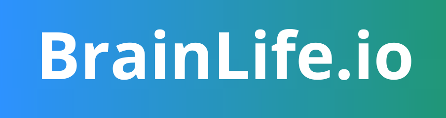

You are free to use the following logos / images in your scientific publications or posters to cite or reference brainlife.io platform.

## SVG

### [brainlife.io.svg](img/media/brainlife.io.svg)

### [logo.svg](img/media/logo.svg)

## PNG

The following are bitmap version of the above logos. Please use SVG versions if possible.

### [logo.png](img/media/logo.png)

### [logo_grayback.png](img/media/logo_grayback.png)

### [brainlife.io.png](img/media/brainlife.io.png)

### logo1

png 

svg

