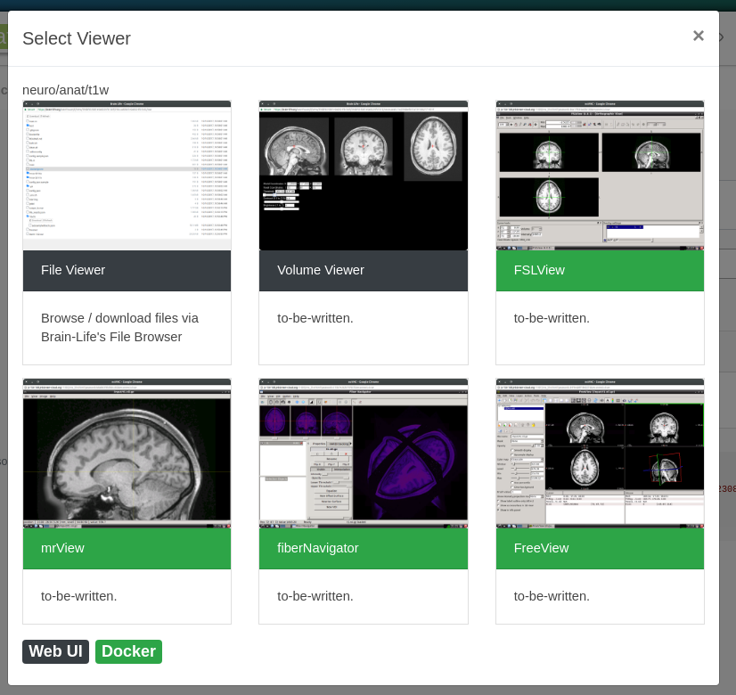

#Brainlife Architecture

## Overview

Brainlife is constructed as a collection of independent [microservices](https://microservices.io/). Currently, there are two major groups for these services; Warehouse, and Amaretti. 

These services are distributed across multiple docker hosts and various VMs on [Jetstream-Cloud](https://jetstream-cloud.org/). They mainly communicate through REST APIs and/or AMQP message bus. All external web traffics are proxied through our API proxy (nginx). Our infrastructure also includes monitoring and operational services which are not included in the above diagram.

### Amaretti

[Amaretti](https://brain-life.github.io/amaretti/) is another major service group that handles orchestration of tasks(jobs) and workflows on various computing resources. Amaretti is what we call "meta" orchestration service, meaning it sits on top of various local batch scheduling systems such as PBS, CondorHT, and slurm to handle the actual job executions on the remove computing resources. Amaretti simply orchestrates and monitors these heterogenesous computing resources and abstracts various common operations requested by our users.

### Authentication

We have developed a simple authentication service which maintains user information and allows them to signup / signin and issue JWT token that can be [statelessly authenticated](https://www.jbspeakr.cc/purpose-jwt-stateless-authentication/) by other services.

### AMQP / Event

[The event service](https://github.com/soichih/event) allows web UI and CLI to subscribe to an event stream via websocket. Various services publish events such as task/instance status or dataset detail updates. Other services can then subscribe to these events with an appropriate access token to receive in realtime, or queue these events to be handled by various event handlers.

### Warehouse 

[Warehouse](https://github.com/brain-life/warehouse) provides a bulk of Brainlife specific functionalities. Brainlife web UI and CLI (command-line-interface) primarily interface with warehouse APIs to fulfill most user requests. Warehouse provides functionalities such as organizing datasets under projects, orchestrating pipeline rules, and requesting Amaretti to submit jobs or move datasets between various computing resources as well as staging and archiving datasets to and from the Warehouse archive. All new datasets are currently archived on XSEDE Wrangler and optionally copied to IU SDA tape archive system as a backup for published datasets.

Brainlife's web UI is written using [VueJS](https://vuejs.org/); a popular Javascript frontend framework. Standard post-processing tools such as webpack and babel are used to compile our UI code before delivered to the user's browser. A small amount of server-side rendering is performed periodically to provide scheme.org descriptors for our public assets; such as Apps, Publications, Projects. This also promotes discoverability of those assets by various search engines.

#### Modular Processing

Brainlife platform allows App developers to register [datatypes](https://brainlife.io/docs/user/datatypes/). Each App exchange data through registered datatypes and this allows App to be written in a modular fasion; each App is only responsible for specific data processing (alignment, tracking, statistical analysis, etc..) which increases the amount of code reuse, and App developer can focus on truly unique aspect of their App. For example, statistician writing a statistical method does not have to concern how the input data is preprocessed, or a developer writing fiber tracking App does not have to write code that analyzes generated fibers which is commonly handled by tract profile analysis Apps. From a user's point of view, module design allows them to more easily compose their workflow using interchangable Apps that fit their needs. User can also more easily experiment with newer version or different algorithms only on a part of their workflow.

Allowing users to compose different App increases a chance of incompatibility between Apps. For example, although an App might take anat/t1w input, it might only work properly with *acpc aligned* anat/t1 input. To reduce the risk of imcompatibility between the Apps, Brainlife allows each datasets to be tagged by ["datatype tags"](https://brainlife.io/docs/user/datatypes/#datatype-tags). App developer can then specify certain datatype tags to be required by its input. This prevents users from submitting Apps with incompatible input dataset.

Brainlife Apps are designed to process one subject at a time. If a user wants to run an App across multiple subjects, the same App must be submitted as many times as there are subjects. This allows Amaretti to submit Apps as an individual jobs on HPC / high-throughput-computing systems, and even across multiple resources if necessary and/or when those resources are available. Eventually, this approach would enable us to submit jobs on truely D-HTC systems for a large "big data" processing. Submitting invidual jobs for each subject also allows us to better handle error that occurs on certain subjects without impacting the overall workflows. As the number of processed subjects increases, it is more likely that some subjects will never complete successfully (such as due to data issue).

#### Bulk Processing

As we modularized our data processing, it created issues for managing our data processings. For example, if a user wants to submit a workflow consiting of 10 individual Apps across 200 subjects, it will require 2000(10x200) indivisual jobs to be submitted and monitored. 

To manage this, we have developed a mechanism which we call [pipeline](https://brainlife.io/docs/user/pipeline/). The pipeline allows ["stream processing"](https://medium.com/@gowthamy/big-data-battle-batch-processing-vs-stream-processing-5d94600d8103) of Brainlife archived datasets and it can be configured by creating a series of "rules" through a simple user interface. Each pipeline rule is responsible for submitting a specific App whenever it detects a new input dataset and corresponding output datasets that are yet to be generated. Brainlife's pipeline rules are evaulated continously (until they are deactivated) and can be setup one rule at a time while executing earlier rules. We believe that our method of handling large workflows through stream processing method has several adavantages over more conventional workflow management systems such as PegasusWMS, Nipype, condor DAGMan, where user would imperetively define the entire workflow on various programming langauges or in a proprietary syntax and execute (submit) the entire workflow.

The advantages are ...

* More error resilient, and allows users to handle / recover from issues that are not anticipated when the workflow is first conveived. When a job fails, the failed job can be handled individually, or setup another set of rules to process subset of subjects to work around the problem while other rules are still active.
* Whenever new datasets becomes available (either uploaded by users, generated by another process, or by other rules), existing rules will automatically detect those new datasets and submit new jobs if necessary. Pipeline rules can be configured once, and left alone for as long as necessary (nothing needs to be "resubmitted" to handle new datasets.)
* Can be configured through GUI (no programming / special syntax is needed). Easier for novice users as complexity can be *added* rather than having to think through everything before submitting the entire workflow.

The disadvantages are ...

* When there are many rules involved, it is difficult to understand the entire workflow (a better visualization might help)
* Each rule is applied to all *subjects*. It is difficult / impossible to define rules that operates on multiple subjects simultanously; like to aggregate outputs from all subjects (we have a different mechanism to accomplish this)
* Could lead to infinite loop as our system is not *DAG* (hasn't happened yet)

### CLI

[Brainlife CLI](https://github.com/brain-life/cli) is primarily used to upload/download datasets to/from user's computers. CLI also provides some capabilities available through the Web UI such as submitting/monitoring a task, and querying various assets that user has access to. Brainlife CLI is currently written in nodejs and distributed through npm; a popular cross-platform software packaging library. Unlike the Web UI, user must manually install npm anb brainlife CLI tool, and keep it up-to-date.

### Visualization

Brainlife provides several ways to visualize stored data-objects. The first way is through web based UI tools such as [BrainBrowsers](https://brainbrowser.cbrain.mcgill.ca/) and [TractView](https://github.com/brain-life/ui-tractview). These UIs will run on user's web browser and download necessary data-objects via Brainlife's web API. Some of these App requires GPUs on user's machines.

Another way is to launch native UIs such as Freeview, fsleyes, and fibernavigator on Brainlife's GPU-enabled visualization VMs and streamed to user's browser using web-based VNC client.  This approach allows our users to entertain familar UIs and visualize their data-objects without having to install these UIs and downloading data-objects to be visualized. The only component required by the user is a web browser. 

