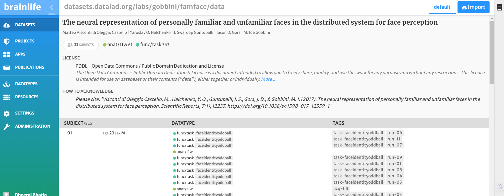
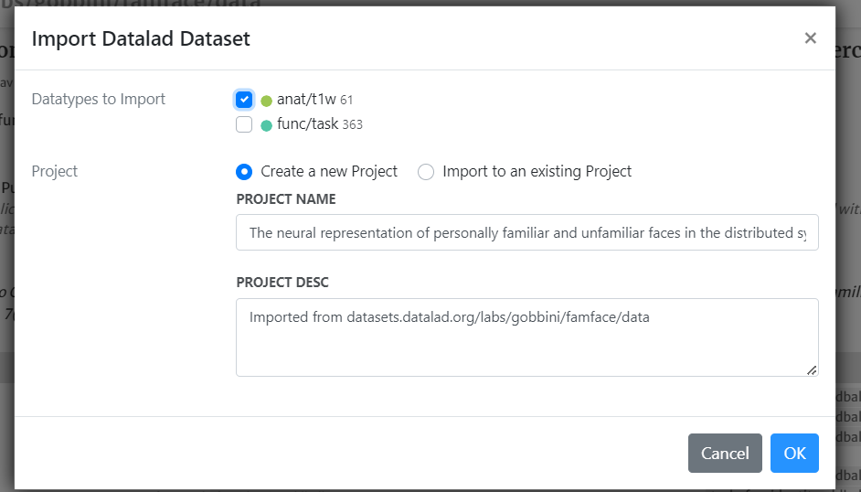
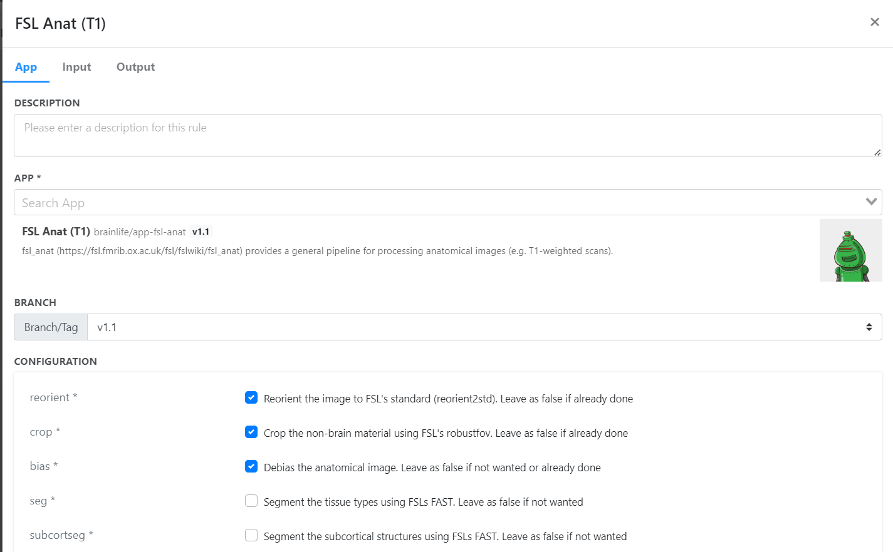
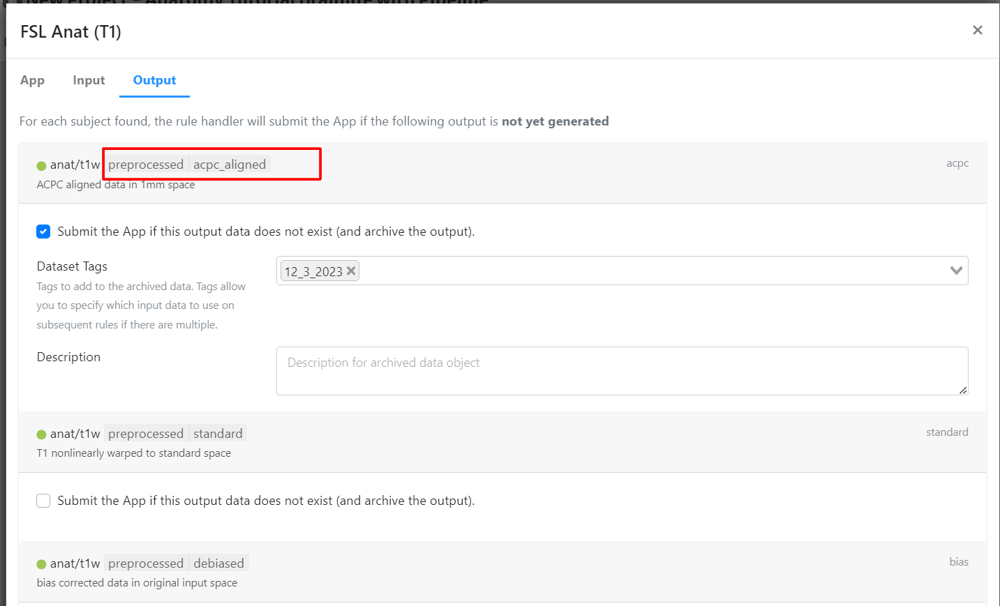
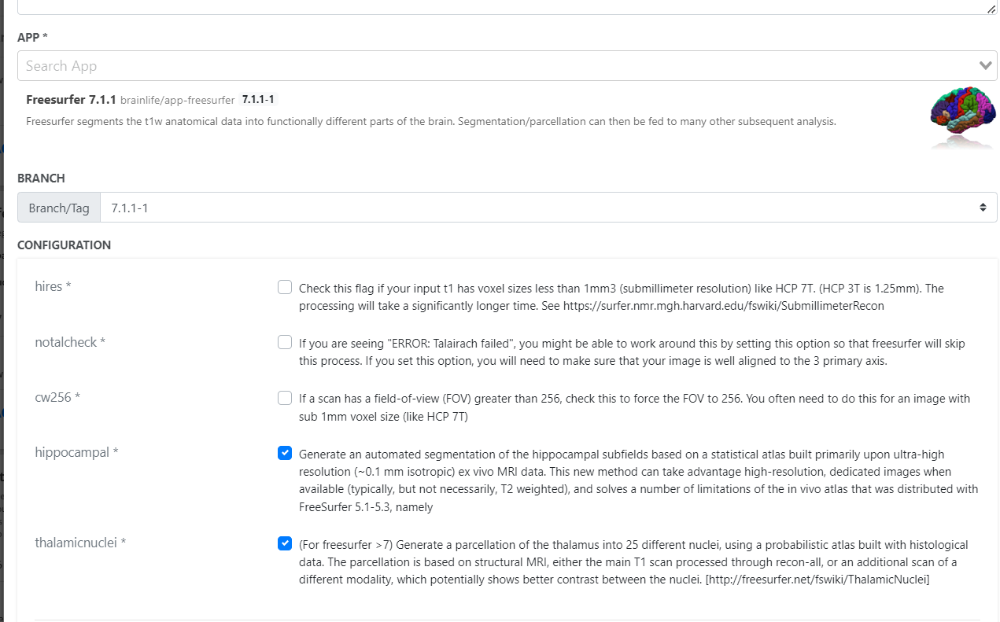
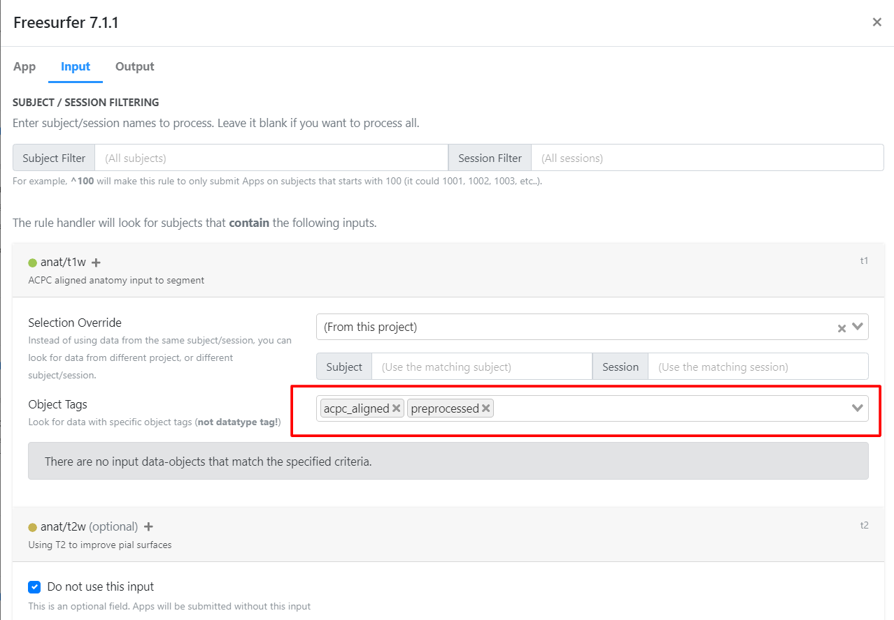
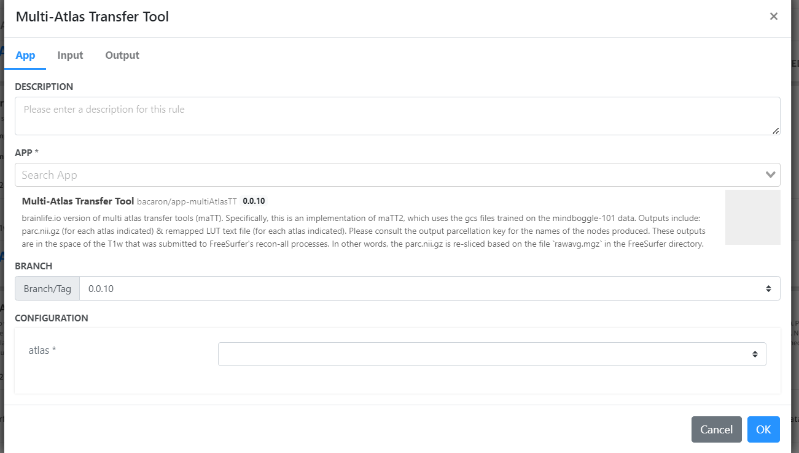
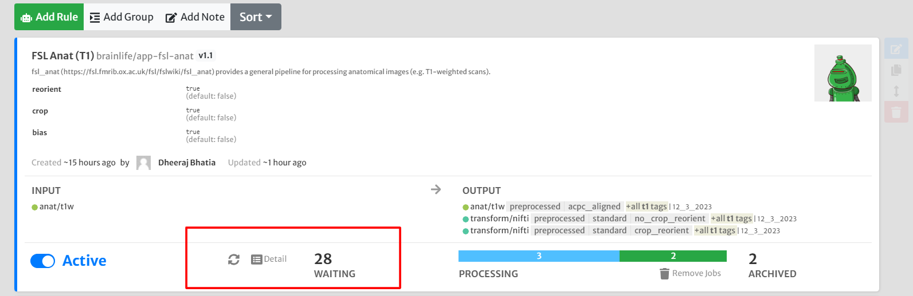
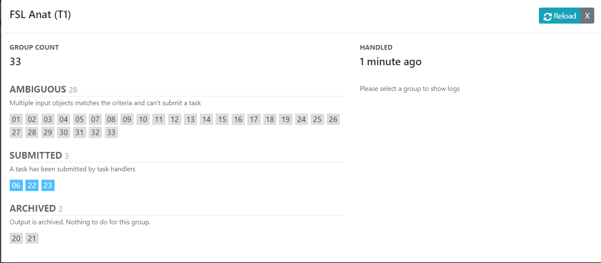

## Introduction to Pipelines on Brainlife.io

Welcome to a specialized tutorial where we transition from manual task submission to the efficient and automated use of pipelines in the Anatomical (T1-weighted or T1w) preprocessing on brainlife.io. This tutorial is tailored for those looking to streamline their neuroimaging workflows, emphasizing the power and convenience of pipeline automation.

By leveraging pipelines, you can automate repetitive tasks, ensure uniformity across your data processing, and save valuable time. This tutorial will guide you through converting the traditional, manual steps of T1w preprocessing into a set of pipeline rules that work seamlessly in the background.

This tutorial assumes familiarity with brainlife.io and basic neuroimaging concepts. If you're new to brainlife.io, consider completing the introduction-to-brainlife tutorial before proceeding.

In today's example we will recreate peices of Anatomical (T1w) preprocessing but as a pipeline automating the processing of 33 data items. 

## Role of Tags in Pipelines
Tags play a crucial role in Brainlife Pipelines as they provide a way to organize, categorize, and track data throughout the pipeline workflow. They serve several important purposes:

- Pipeline Flow Control: Tags are used to specify input and output data requirements for each rule in the pipeline. They ensure that the right data is used as input for a specific task and that the resulting output is properly tagged for future steps.

- Data Organization: Tags help categorize and label datasets, making it easier to manage and locate specific data objects within your project. This is especially valuable when dealing with large datasets and complex workflows.

- Data Versioning: Tags help maintain data versioning and lineage. By tracking which rule produced which output with specific tags, you can trace the history of your data and ensure data consistency.

- Customization and Flexibility: Tags allow you to customize and tailor your pipeline rules to your project's specific needs. You can use tags to filter and select data for processing, ensuring that each rule operates on the correct data subset.

## Step 1: Importing the Dataset

**Dataset Import**: Import the dataset from [Sample Dataset](https://brainlife.io/dataset/datasets.datalad.org/labs/gobbini/famface/data) into your brainlife.io project.

!!! warning
    Note: Only choose anat/t1w data

## Step 2: Adding Pipeline Rules

### Rule 1: Preprocessing and Alignment of T1w Images

1. Add Rule: In the Pipelines tab, click "Add Rule".
2. **App Selection**: Search and select 'FSL Anat (T1)'.
3. **Configuration**:
   - Check 'crop', 'reorient', and 'bias'.
   - Select 'MNI152_1MM' as the template.
4. Submit the rule.

**Output Tags**:
- Click on the output tab.
- Note the tags 'preprocessed' and 'acpc_aligned'. These tags will be referenced in subsequent apps.

### Rule 2: Freesurfer Surface Generation and Parcellation

1. Add Rule: Click "Add Rule" again.
2. **App Selection**: Search and select 'Freesurfer 7.3.2'.
3. **Configuration**:
   - For input, select the ACPC aligned anatomical image (output from the previous rule).
   - Enable 'hippocampal' and 'thalamicnuclei'.
   - Enable 'Archive all output datasets when finished'.
   - Type 'freesurfer' in 'Dataset Tags'.
4. **Input Tags**:
   - Go to the Input tab.
   - Add the object tags 'acpc_aligned' and 'preprocessed'. These tags will link to the output of the first app.
5. Submit the rule.

### Rule 3: Multi-Atlas Transfer Tool

1. Add Rule: Add another rule.
2. **App Selection**: Search and select 'Multi-Atlas Transfer Tool'.
3. **Configuration**:
   - For input, select the Freesurfer output (from the previous rule).
   - Select 'hcp-mmp-b' as the atlas.
4. Submit the rule.

Once this is ready make all rules active!

Check the progress by refreshing and by clicking the details icon. 

## Exercises

### Question - Why did we not use input tags for Multi-Atlas Transfer Tool ? 

### Exercise : Complete the Pipeline with Freesurfer Brain Parcellation - Statistics in a new project 
