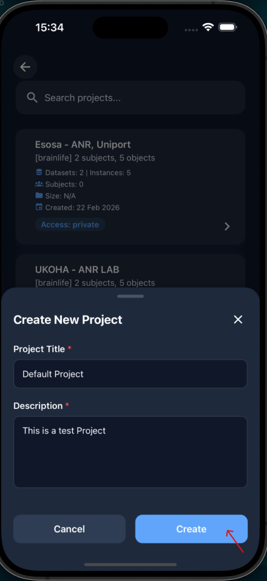
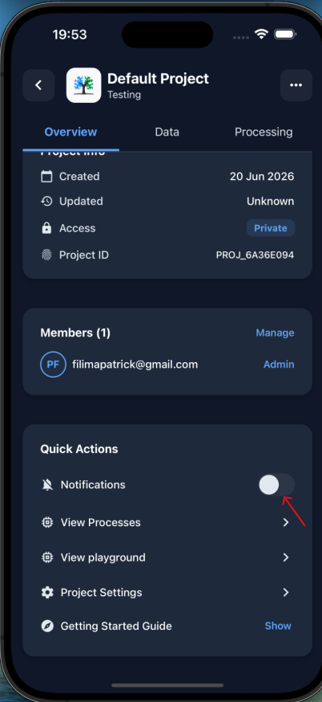
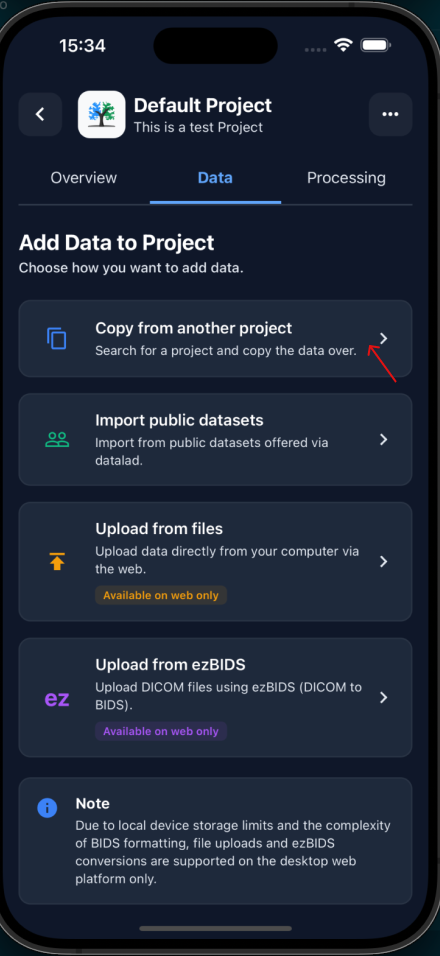
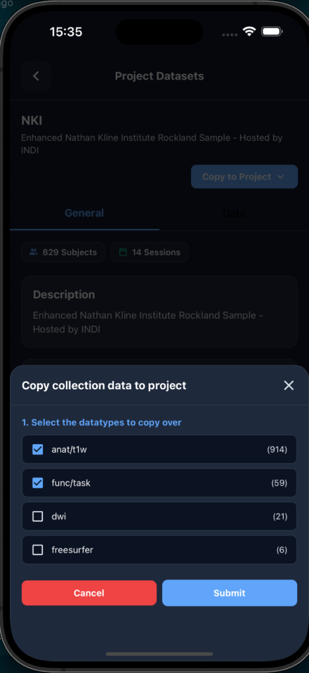
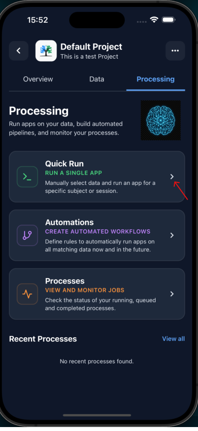
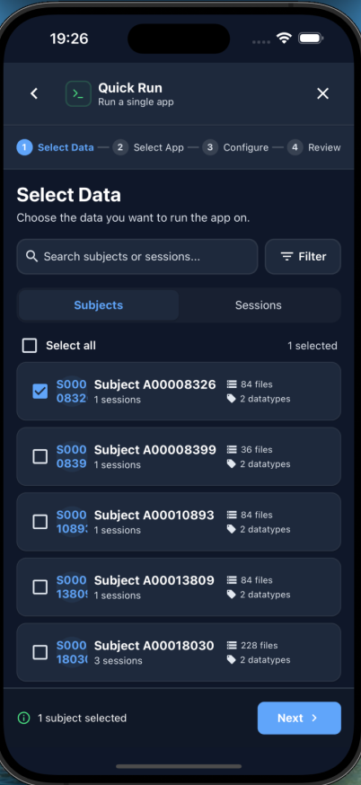
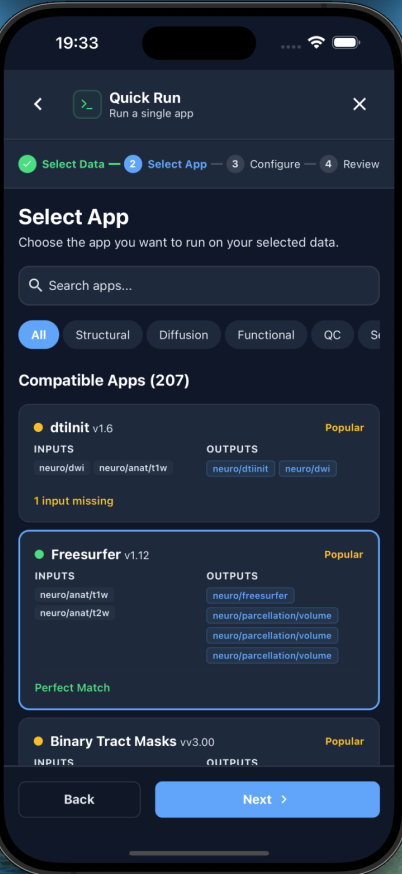
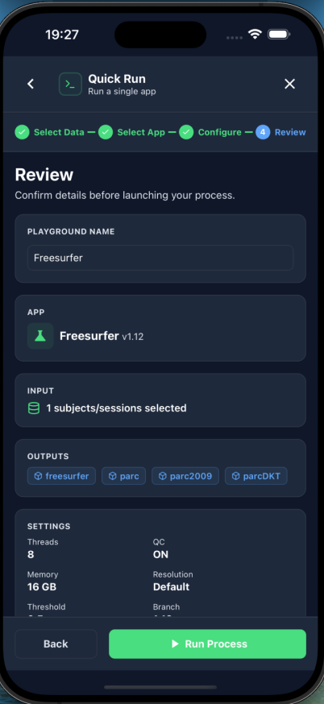
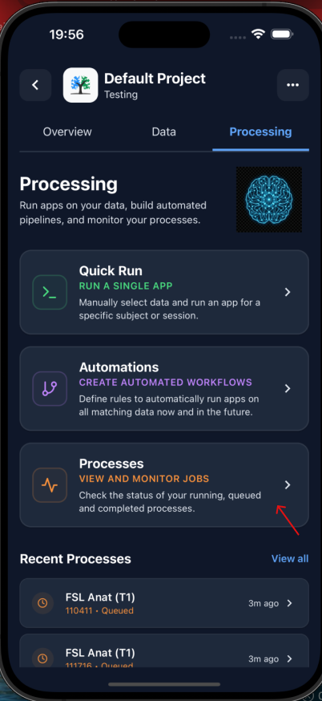
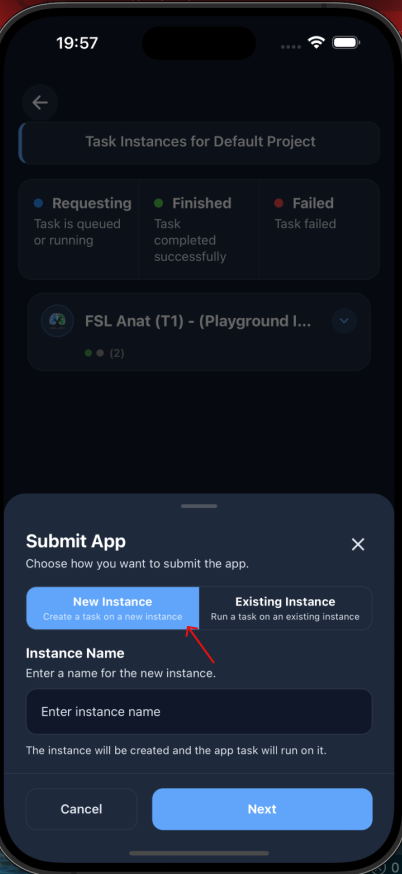

## Brainlife Mobile App Tutorial

The **Brainlife** app is the official app for the brainlife.io platform. It allows you to monitor and manage your projects, datasets, apps, and publications on the go, bringing brainlife.io's neuroimaging analysis directly to your mobile device.

This page highlights the step-by-step instructions on how to perform key operations in the Brainlife app, including authenticating your account, creating a project, subscribing to notification alerts, importing datasets, running processes via Quick Run, submitting custom apps, setting up automation pipelines, executing quality control validation, and monitoring playgrounds.

---

### A. Authenticate and Log In

Before managing and processing your neuroimaging data on the go, you must sign in to your Brainlife account.

1. Open the **Brainlife Mobile** app on your device.
2. Choose your preferred authentication method:
    * **Username and Password**: Enter your Brainlife credentials directly in the login form and tap **Sign In**. The app securely authenticates with the Brainlife servers.
    * **Third-Party Providers**: Tap **Google**, **GitHub**, **ORCID**, or **Apple**. The app will launch a secure system browser session to complete the authentication.

---

### B. Create a Project

To begin managing and processing datasets in the app, you need to create a project.

1. Open the sidebar navigation menu in the top-left corner.
2. Select **Projects** to navigate to the project browser.
3. Tap the **+** (plus) floating action button located at the bottom-right corner of the screen.
4. Enter the **Project Name** and **Description**.
5. Tap the **Create** button.

{: style="max-width: 200px; width: 100%;"}

*Upon completion, the app will automatically create your new project and navigate you directly to its Project Detail screen.*

---

### C. Manage Project Notifications

Stay informed of processing updates, failures, or completions by subscribing to project-specific notifications.

1. On your project detail page, scroll down under the **Overview** tab.
2. Locate the **Quick Actions** panel.
3. Find the **Notifications** toggle.
4. Toggle the switch to subscribe to or unsubscribe from notification alerts.

{: style="max-width: 200px; width: 100%;"}

---

### D. Copy and Stage Datasets

To run analysis tasks on your staged project, you must first import neuroimaging datasets.

1. Navigate to the project page and tap the **Data** tab.
2. Tap either **Copy from Another Project** or **Import Public Dataset**.

{: style="max-width: 200px; width: 100%;"}

3. The app will prompt you to select datasets from either your existing projects or a list of open public datasets.
4. To copy project data:
    * Select the target project to open its details.
    * Tap the **Copy to Project** action button.
    * In the modal that appears, select the specific neuroimaging data types you wish to copy.
    * Tap **Submit** to finalize staging.

{: style="max-width: 200px; width: 100%;"}

---

### E. Run a Task via Quick Run

For standard analyses, you can initiate a process execution directly using the simplified Quick Run interface.

1. Tap the **Processing** tab of your project.
2. Tap the **Quick Run** card.

{: style="max-width: 200px; width: 100%;"}

3. In the process creation view, select the input dataset you wish to analyze.

{: style="max-width: 200px; width: 100%;"}

4. On the **Select App** tab, the app catalog automatically recommends pipelines and apps based on the datatype and input requirements of your selected dataset.

{: style="max-width: 200px; width: 100%;"}

5. Select the desired app, configure the app settings according to your research parameters, and tap the **Run** button.

{: style="max-width: 200px; width: 100%;"}

---

### F. Submit a Job via View Processes

For custom execution workflows, you can submit apps directly from the project's active processes timeline.

1. Navigate to the **Overview** tab of your project detail screen.
2. Scroll to the **Quick Actions** section and tap **View Processes**.

{: style="max-width: 200px; width: 100%;"}

3. Tap the floating **Submit App** action button in the bottom-right corner.

{: style="max-width: 200px; width: 100%;"}

4. Browse or search for your desired app in the App Store catalog, define the inputs, and submit the process.

---

### G. Create an Automation Rule (Pipeline)

Automation rules allow you to define processing pipelines that run automatically on new matching subject data as soon as it is archived or copied to the project.

1. Access the **Create Automation Rule** wizard via the project pipeline interface.
2. Follow the four-step stepper timeline to construct your pipeline:
    * **Step 1: Select App**: Choose the Brainlife app to run.
    * **Step 2: Configure Rule**: Enter the automation rule's name, description, Git branch (defaults to `master`), and toggle parameters like **Cleanup on Success** or string matching criteria for subjects and sessions.
    * **Step 3: Configure Inputs**: Define the input query tags and configure overrides (project, subject, or session overrides).
    * **Step 4: Configure Outputs**: Set up your output archiving behavior and append custom output tags.
3. Tap **Submit** to deploy your rule. The background system will continuously process any matching incoming datasets.

---

### H. Visual Quality Control and Validation

Brainlife Mobile features a native **Validator** screen designed for rapid quality control (QC) of finished processing tasks:

1. Locate a completed task in the **Processing** tab.
2. Select the task to open its dedicated **Validator** screen.
3. Inspect 2D cross-sectional slices of the resulting brain maps across three orthogonal planes: **Sagittal**, **Coronal**, and **Axial**.
4. Toggle between **Standard** and **ACPC** space orientations to visually inspect alignments.
5. Previews are generated as secondary PNG images for mobile efficiency. For full-resolution interactive exploration, download or view the primary dataset.

---

### I. Monitor Computational Playgrounds

Computational playgrounds provide interactive computing instances for custom tasks. You can monitor their active processes in real time:

1. On the project's **Overview** tab, scroll to **Quick Actions** and select **View Playground**.
2. Browse through all configured playgrounds, viewing their IDs, Instance IDs, and creation dates.
3. Tap on a playground card to open a slide-up modal showing all associated tasks.
4. The playground interface establishes real-time websocket connections to receive task status updates (such as *Finished*, *Running*, *Failed*, etc.) as they execute on the backend cluster.

---

### J. Real-Time Notification Feed

The global **Notification Feed** acts as a unified hub for tracking activity across all your Brainlife projects.

* **Activity Summary**: Monitor task status changes (Success, Failure, Staged, etc.) in a consolidated feed.
* **Relative Timestamps**: Each card displays human-readable relative time (e.g., "now", "12m ago", "3h ago").
* **Color-Coded Statuses**: Left border colors match task status (Green for success/completed, Red for failed, Blue for running).
* **Deep Linking**: Tap any notification card to jump directly to the relevant **Project** page or the **Processes** timeline on your app to debug failures or review successful outputs.

---

### Technical Stack Overview

For developers interested in contributing or extending the app, the technical architecture consists of:

* **Core Framework**: React Native with Expo SDK 52
* **Navigation & Routing**: Expo Router (file-system based routing)
* **State Management**: Zustand
* **Local Credentials Security**: Expo SecureStore (encrypted on-device storage for JWT tokens)
* **Push Notifications**: Expo Notifications integrated with Firebase Cloud Messaging (FCM)
