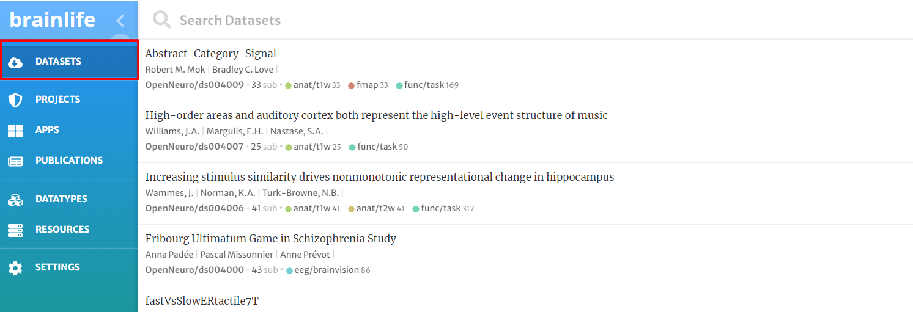
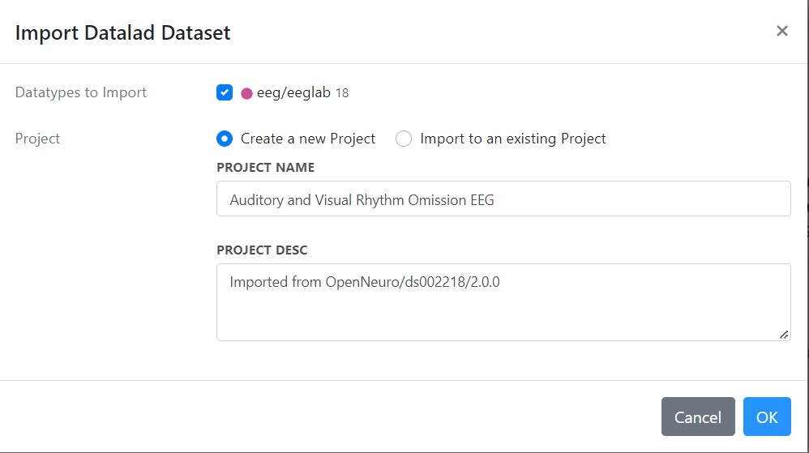

# Datasets

Brainlife uses DataLad to provide seamless access to dataset published on OpenNeuro.org as well as on other open datasets.
Datasets mapped by DataLad can searched and imported directly from within the Brainlife interface.

Head over to the [Datasets Page](https://brainlife.io/datasets) or click on the Datasets Tab.

Then choose a dataset and then choose the version of the dataset that you would like to use for project.

Choose the dataset you want to import, and then choose a project or create a new project.
Click Ok to import the dataset.

Datasets can be imported either in a new Brainlife Project or into an existing project.
