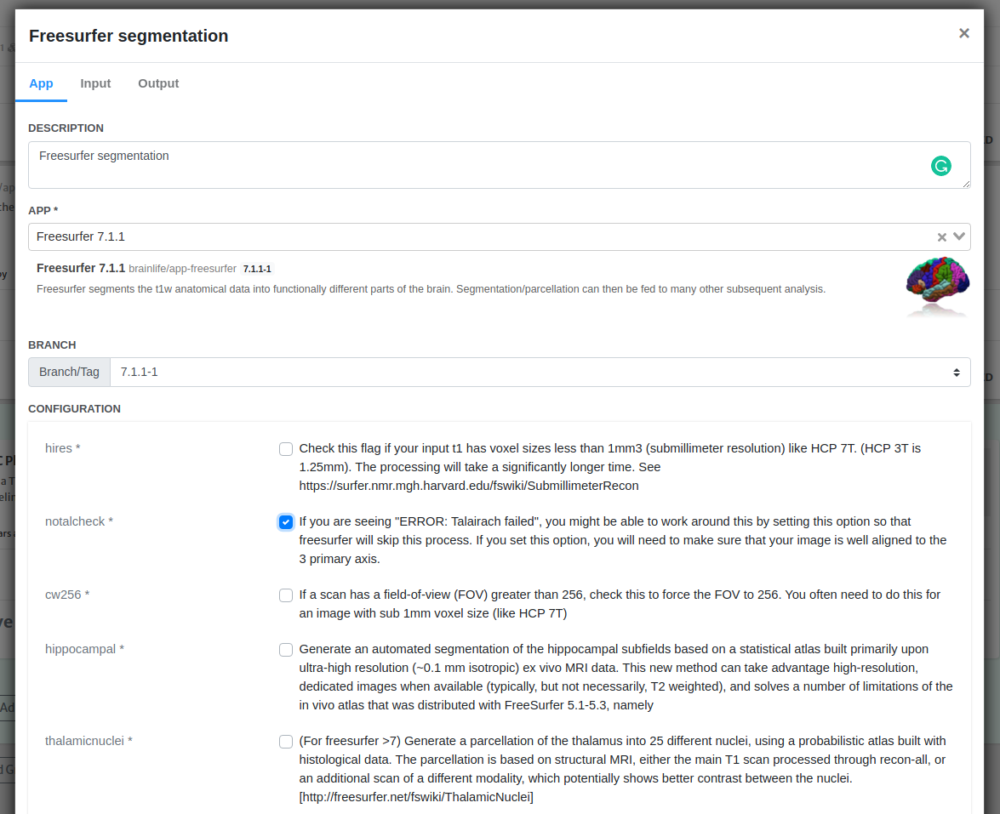
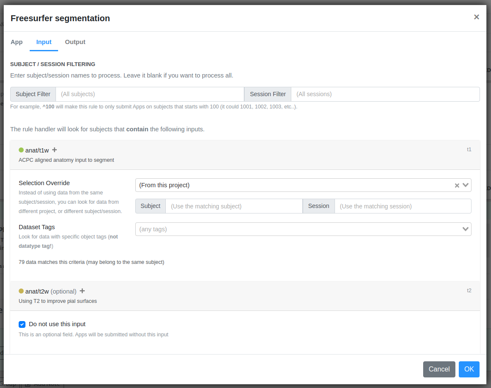
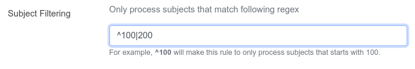
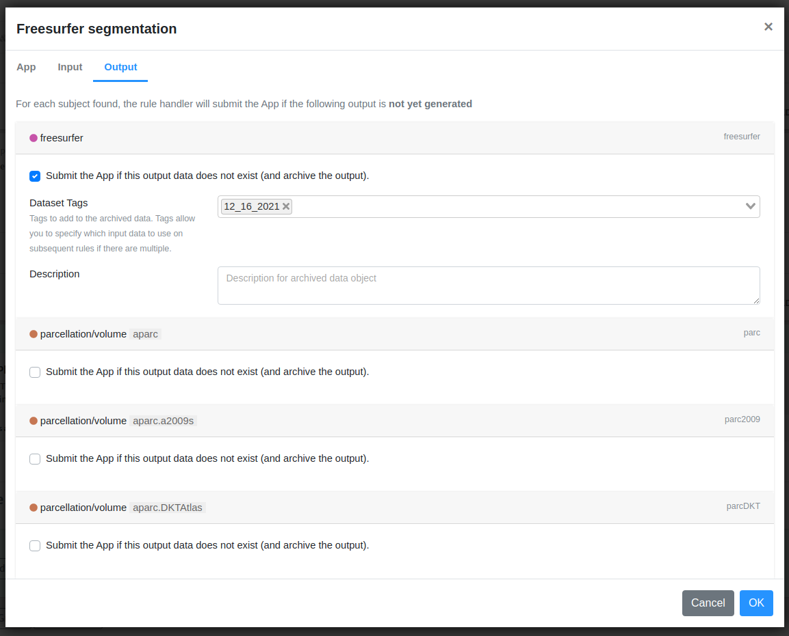
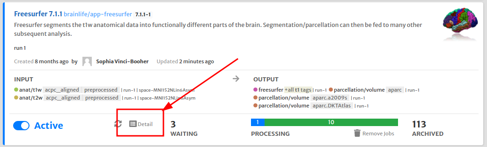
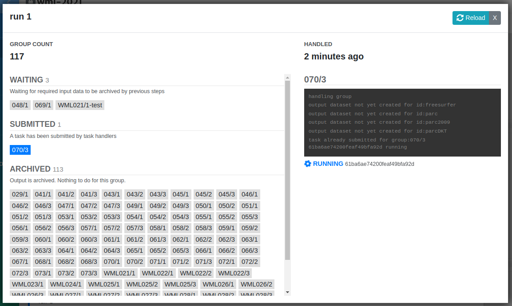
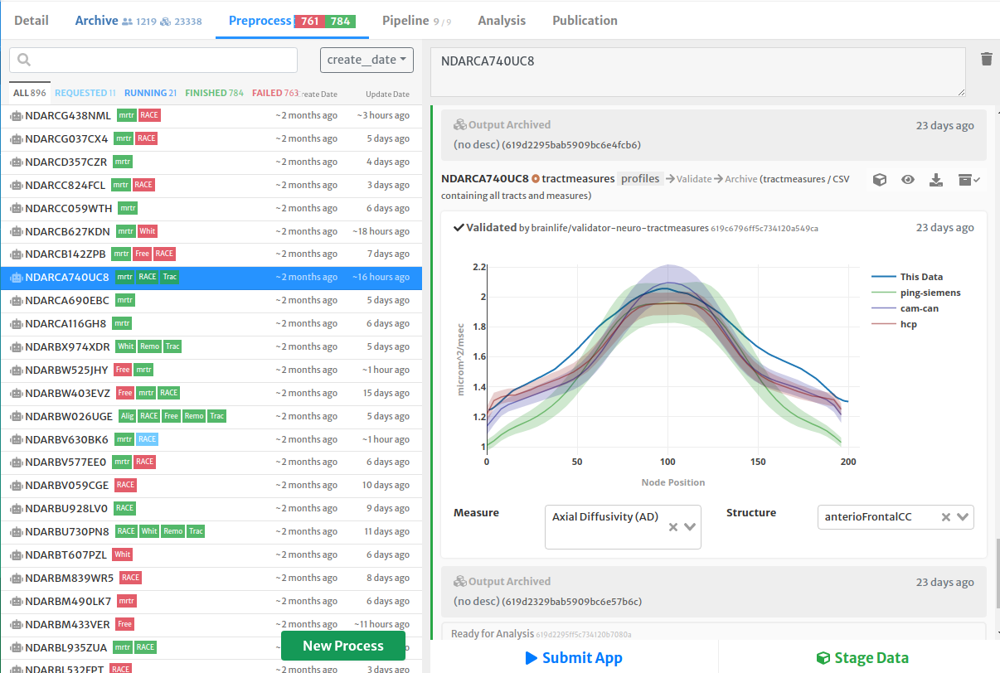

# Pipelines

The `Preprocesses` tab allows you to submit tasks one at a time. This is great if you are exploring different Apps or experimenting with different configurations that can best process your datasets. However, once you find the optimal set of Apps, you would probably want to run it across many subjects and submitting them one by one is simply not a good option.

<!--
When you are processing a large number of subjects, it is often inevitable that some subject would require a different set of configuration, or simply not possible to process at all. This might be due to data quality issues, incorrect metadata, etc. With a common workflow orchestration system, you are often tasked to develop a workflow script or some sort, submit it, and keep up with witch subjects has failed on which part of the workflow so that you can repeatedly re-submit a partial workflow until all subjects are processed.
-->

Brainlife allows you to setup *pipeline rules* that can automate the submission of tasks. Instead of describing the entire workflow that you submit **once** (or re-submit if something fails), you will define a set of individual rules which will be continuously evaluated until there are no more data to process. You can think of it as a factory assembly line producing products where each steps within the assembly line as piepline rules. When a subject fails to produce an output dataset for a specific rule, you can examine and handle it manually. Once you can produce a valid output, the rest of the pipeline rules will pick it up as if it came from the original rule.

<!--
We believe our rule-based submission system is easier to setup, and more error-tolerant that more conventional orchestration methods (it is also much easier to implement).
-->

## Setting up Pipeline Rule

To setup a new pipeline rule, go to Project > `Pipelines` tab and click on "Add Rule" button.

Each rule will be responsible for submitting a specific App with a specific set of configurations. Enter a description for this rule, and search for the App that you'd like to submit. Once you select an App, you will be able to set its configuration parameters.

All Brainlife Apps have a defined list of input datatypes that App requires to run. Brainlife will look for any subject that provides all required input datatypes, and submit a new process for each subject using above specified configuration. If your project contains more than one data objects that matches the required datatype for a subject, you will need to add specificity to the input data by adding datatype / object tags in the input tab.

When you are submitting your first rule, you might not have all the input data objects stored in your project itself. The selection override field allows you to pull data from other "parent" projects.

If you'd like to submit jobs only for a subset of subjects/sessions, you can specify subject names (in regular expression) in `Subject/Session Filter` field.

The above example will make this rule to only submit for subjects with names that start with "100" or "200". When you are setting up your first rule, it's always good to limit the number of subjects to make sure your rule is set up correctly.

!!! hint
    There are regular expression tutorials available online. Also, please feel free to send us your question via Brainlife slack team.

Brainlife also won't submit a new process if your project already has an output that matches the output datatype/tags (for example, maybe other rules has already produced the output, or copied from other project, or generated manually by the user through process tab). To be more specific about which data objects are generated by which rule, you can specify output dataset tags under the output tab.

You can leave this default if you know there won't be any other App generating the same output datatype. We recommend to always set output dataset tags just in case.

## Monitoring Pipeline Rules

Once you submit your pipeline rule, it should start submitting processes and you can monitor them its status on the main pipeline page. You can find out more details about the rule by clicking "Detail" button.

As pipeline rule simply automates submission of jobs, you can also monitor job executions under Preprocessing tab just as you'd monitor tasks submitted manually in the preprocessing tab.

You can interact with pipeline submitted tasks as you normally do with any processes; examine outputs, stop, restart, etc. The output datasets will be automatically archived once each task has completed successfully.

!!! note
    If you remove a process or task, Brainlife will resubmit another process to handle that subject if the subject has all required input datasets and has not produced the output from the requested app yet. If you don't want them to be resubmitted, please remove or deactivate your rule.

## Updating Pipeline Rule

If you need to update your pipeline rule, you should first deactivate the rule so that no more jobs will be submitted, and depending on the type of the update you are making, you should also remove all existing jobs especially if you are trying to make configuration changes. Otherwise, some subject will be processed using the old configuration, and some will be processed using the new configuration. You will also need to remove any output already generated / archived using the old configuration.
