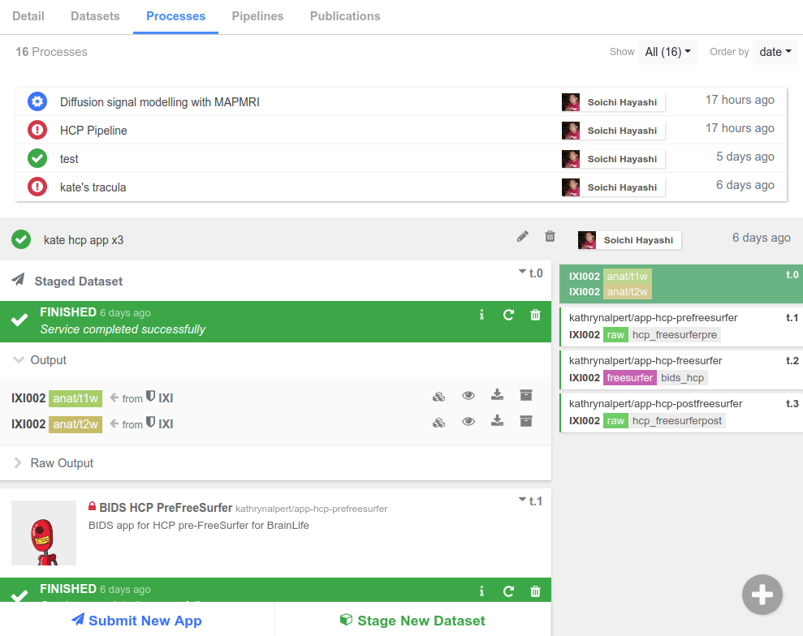
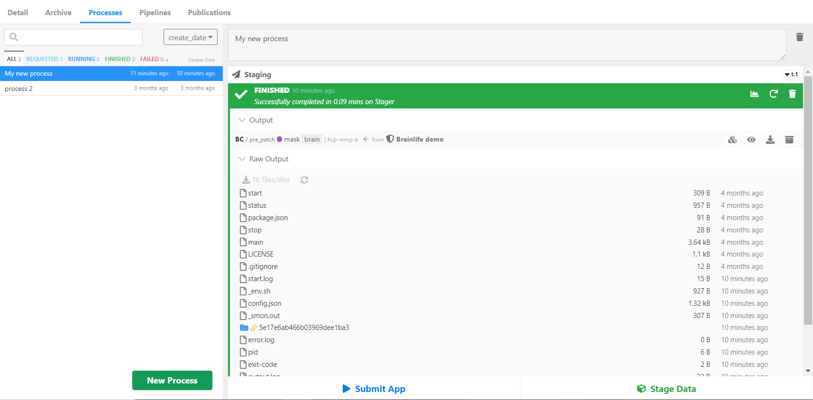
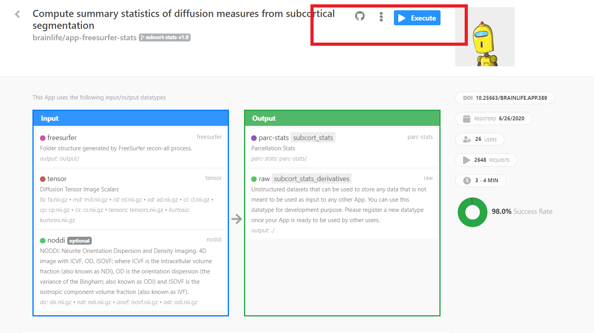
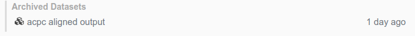

# Processes

> Hey there! If you have not read the [data processing section](/docs/user/started/#data-processing) of the introductory tutorial yet, please do that first.

Now that we are `Projects` experts, we can cover `Processes` in-depth. In any Project you create, you will have a `Processes` tab (like in the image below), where you will perform all of your data analysis. A Process is a logical grouping of data analysis and processing tasks that share input and output datasets.

## Staging Data 

Processing data begins with **staging your datset.** You can stage a dataset from any project and subject you have read access to (but remember that it may be helpful to create a separate Process for each subject). To stage data, simply click the `Stage Data` button and fill in the [data-object information](/docs/user/started/#brainlifeio-terms-to-know). 

If you want a step-by-step guide for staging data, follow our [data processing tutorial](/docs/user/started/#data-processing).

After you submit a task, brainlife.io will automatically assign your task to the next available computing resource (that you have access to). Our task orchestration service, called [Amaretti](https://github.com/brainlife/amaretti){target=_blank}, takes care of data transfer. 

Amaretti also monitors your task status for you. You can see this once you submit a task -- a blue bar pops up and says "Requested" once you submit and then "Running" while the task is processing. The bar turns green and says "Finished" when the task is done. You can see the log content by opening the `Raw Output` section of the task and selecting any log files you want to take a closer look at.

!!! note
    The `Raw Output` section will not be available for tasks that are not yet assigned to a resource.

If you want to download a file, you simply click the (:fa-download:) icon to download individual files and entire directories.

## Submitting Apps

The Processing tab is not only where you stage data on brainlife.io but also where you submit Apps. To submit an App, simply click the `Submit App` button in your `Processes` tab. 

brainlife.io selects Apps that you can execute by comparing the datasets staged in your process with the required input datasets for each App. The more datasets you stage or create, the more Apps you can submit. If you do not find the App you are looking for, head over to the [Apps page](https://brainlife.io/apps){target=_blank}. When you find the App you want, you can execute it directly from the App page by selecting the `Execute` button. Or you can go back to the Processes page and generate or stage the dataset required to run the App.

When you submit an App through the `Execute` button, brainlife.io will create a new process in your selected project, stage all of the input files you selected, and submit your App in a single step.

!!! tip
    If you are looking for a sample dataset, try the [O3D project](https://doi.org/10.25663/bl.p.3){target=_blank} which contains a lot of common data derivatives.
    
## Task Status

Before we finish talking about Processes, let's do a quick breakdown of the task statuses you may encounter while processing data:

* Requested

    When you first submit your task, brainlife.io will confirm it has been `Requested` as the task waits to be assigend to a resource. If there are a lot of tasks being processed on the platform at the same time, it may take a few minutes for your task to be picked up.

* Running

    Once brainlife.io finds the right resource, your task will enter a queue for the resource and then start `Running`. Remember that most resources have their own local batch scheduling systems, so brainlife.io's status might show the task is `Running` while it is actually waiting in the remote queue.

* Finished

    Success! `Finished` means the task was completed **successfully.** You can now visualize output datasets by clicking :fa-eye: buttons next to each output dataset (Hint: This is covered in the [data processing tutorial](/docs/user/started/#data-processing){target=_blank} we keep talking about). If you requested to auto-archive the output datasets, they will be copied to you project's `Archive`.

* Failed

    Job could fail (exit with non-0 return code) in variety of different reasons, so you will need to look at the log file under `Raw Output` and determine why the job failed. Please see [Handling Job Failure](/docs/user/failure/) for more information about troubleshooting.
    
    You can always ask for help in the **#general** channel on [brainlife.io's Slack](/docs/contact/). You can also contact the App developer or submit a Github issue. 

* Removed

    Most resources use a **scratch space** to stage the task's work directory. Normally, scratch spaces have a time limit on how long the data files remain in the system. When brainlife.io detects the task directory no longer exists, it will let you know with a `Removed` tag.

    !!! note
        brainlife.io tries to clean up old task directories within 25 days of the successful completion of the task to provide consistent behavior and reduce disk space across resources. If you have an output dataset you would like to keep, please archive it, or submit the task with the auto-archiving box checked.

        If you archive your output, you will see a list of datasets archived from this output.

        
