# Getting Started with brainlife.io

Now, let’s learn how to use brainlife.io! This “Getting Started” tutorial will give you a quick overview of how to:

* Sign up for brainlife.io
* Create new projects
* Upload data 
* Launch visualizations
* Run processes on data
* Archive results 

We will cover some of these topics more in-depth in other sections of the documentation.
 
## Sign Up

To begin using brainlife.io, you need first make sure you are registered on the site ([you can do that here](https://brainlife.io/auth/)). You can choose to sign up through Google, ORCID, Github, or through your institution. 

To register a personal brainlife.io account, [sign up for brainlife.io here](https://brainlife.io/auth/#!/signup). You will be asked to confirm your email address.

You can associate multiple authenticators with your account once you register by going to Settings > Account > Account Settings. Scroll down to Connected Accounts and click `Connect` next to the authenticator you want to connect through. 

!!! warning
    If you register through a third-party authenticator, please use the same authenticator each time you log in, or you will end up creating multiple brainlife.io accounts.
    
## brainlife.io terms to know
Nice, you now have a brainlife.io account! Before we jump into the rest of the tutorial, it will be good to familiarize yourself with a couple of commonly used terms on brainlife.io.

* **Data-Object**

    A **data-object.** is a set of files for a specific subject and modality -- it is the smallest set of data that you can interact with on brainlife.io. For example, the `neuro/dwi` data-object consists of files such as `dwi.nii.gz` (a file containing the actual 4D diffusion brain image data), `dwi.bvecs`, and `dwi.bvals` (which describe how the image was acquired by the MRI scanner). Freesurfer output for a subject is considered to be a single "data-object" containing many directories and files. brainlife.io processes data at each subject level and for each data-object. 

    You cannot change the content of a data-object once you create it, but you can modify its metadata.
    
* **Datatypes**

    brainlife.io Apps exchange data through **datatypes**. The App below gives an example of how to determine the input-output of  datatypes. The colored boxes indicate that the App will take a `dwi` input data-object and generate another `dwi` data-object with a datatype tag of `masked`, and output another data-object of a `mask` datatype.

    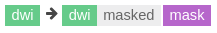

    Developers involved with interoperating input and output data should discuss and agree to the set of files and directory structures and their semantics. You can register a new datatype by consulting #datatype channel on brainlife.slack.com. We will cover datatypes more on the [datatypes page](/docs/user/datatypes).

## Create Project

Let's get to work. To begin using brainlife.io, you will first need to create a new project. 

Projects is where you can organize your datasets, perform data processing, and share work with your team. You will learn more about Projects in the [Projects section](https://brainlife.io/docs/user/project/) of the documentation.

You should automatically land on the Projects page when you enter brainlife.io. If not, your computer is broken. Okay, just kidding. You can click the `Project` button from the menu that runs along the left side of your screen. Then press the `New Project` button in the right-hand corner of the screen (it will look like a plus sign until you hover your mouse over it).

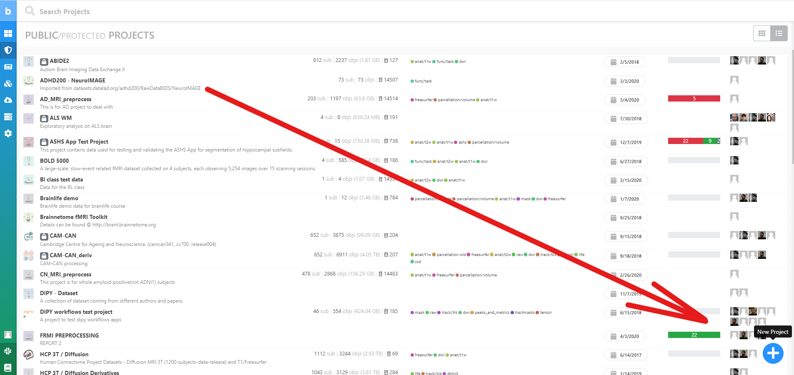

Enter any `Name` and `Description` -- be as creative as you want but be sure to leave everything else as the default option. Then click `Submit`. 

Congratulations! You just created your first private project on brainlife.io. Wow, that was easy!

## Upload Data

Next up: uploading some test data. Once you save your project, it will appear on the top of the Projects page in the `My Projects` section. Click on your project and then click the `Archive` tab.

There are two ways to store data on brainlife.io:

* **Archive**
    The `Archive` tab you are currently on shows all the current content in your data archive. Data-objects under this tab are stored in our archival storage permanently (but not backed-up until you publish them).
    
* **Processes**

    You cannot directly run Apps on archived data. Instead, brainlife.io will automatically stage data-objects from our archive and transfer them to compute resources where the Apps can be executed. Data generated in the `Processes` page will be removed within 25 days unless you archive them (see [Archiving](https://brainlife.io/docs/user/started/#archiving)). 

Got it? Now, go to the same button you clicked to create your project. When you hover over the button this time, it will say `Upload Dataset`. Click it!

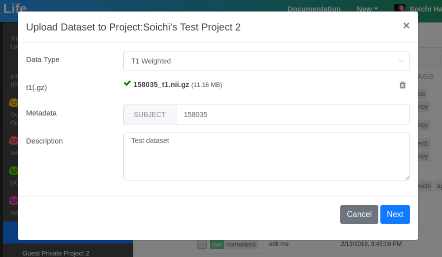

Once you see this form, select the Datatype you want to upload, attach your file, and provide the subject name. If you do not have any data to upload, you can upload data from other [public projects](https://brainlife.io/projects) or import data from the [datasets page](https://brainlife.io/datasets) (one of the many benefits of brainlife.io!). If you do decide to download data from brainlife.io to add to your project, you will need to change the file type, so make sure you have 7-Zip or similar software on your computer. Once you download the data you want, right-click on the file and hover over `7-Zip` and then click `Extract.` Click `OK.` That will extract the data in a GZ file, which you can then upload into your brainlife.io project!
    
If everything looks good on your data upload, click `Archive`.

Now you can see the details of your data in your Archives tab. The `Archived in` field shows where your data is archived (it may take a large data-object a bit longer to be archived). You can make small edits to this profile, such as adding details about the data and tags or editing the metadata. 

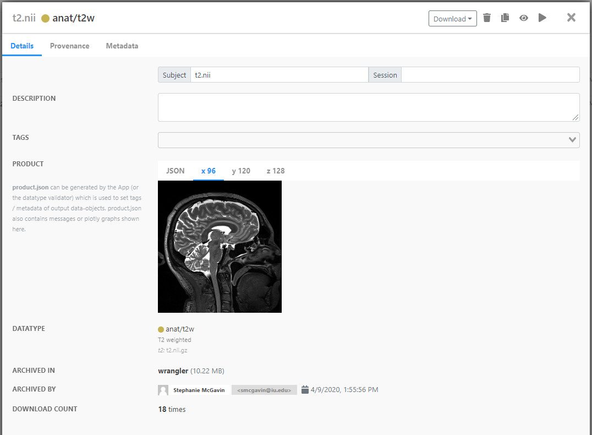

## Visualize Data-objects

Now for the fun stuff. To launch a visualization program, click your data-object record (not the checkbox). Then click on the visualizer icon (which is a fancy way of saying the eyeball (:fa-eye:)) in the upper right-hand corner of the box.

Any data-objects stored in brainlife.io can be visualized using web-based apps or brainlife.io Apps registered for each datatype. 

Once you click the visualizer icon, you will see all of the apps your data-object can be visualized with. Web-based apps have a black bar and brainlife.io registered Apps have a green bar (you can also read which is which in the app descriptions). 

!!! note
    If you are wondering how you can develop and contribute new visualization Apps to run on brainlife.io, email us at [brlife@iu.edu](mailto:brlife@iu.edu). You can also let us know if there is a particular app you would like us to add!

To visualize your data -- simply select the App you want to launch! 

## Downloading BIDS

You can search, select, and bulk-download data using BIDS. In the Archive tab, select the data-object you'd like to download by checking the box next to it. A panel will appear on the right, where you can select the `Download` button. 

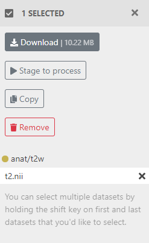

There, you can copy and paste the command for the BIDS download into the terminal on your computer (be sure you have [Bash Shell](https://www.windowscentral.com/install-windows-subsystem-linux-windows-10) downloaded if you use Windows). Then simply type `Terminal` in your search bar and copy and paste the command in the app.

brainlife.io will stage selected data-objects, organize them into a [BIDS structure](http://bids.neuroimaging.io), and let you download the entire structure as a single tarball. Once it's ready, click `Download`.

!!! note
    At the moment, all brainlife.io data-objects will be stored under `/derivatives` directory, regardless of the datatype.

## Apps

Let's move on to `Apps`. Apps are small programs that perform a specific type of data processing. Although we have a few Apps that behave more like a typical *pipeline* or *workflow* (including pre- and post-processing, data analysis, and reporting work), most brainlife.io Apps only perform one specific task.

You can find all of our publicly available brainlife.io `Apps` on the main brainlife.io menu on the left. Don't worry, it is OK to feel both overwhelmed and excited by the amount of Apps you are currently looking at. Sort through them with the `Categories` panel on the right.

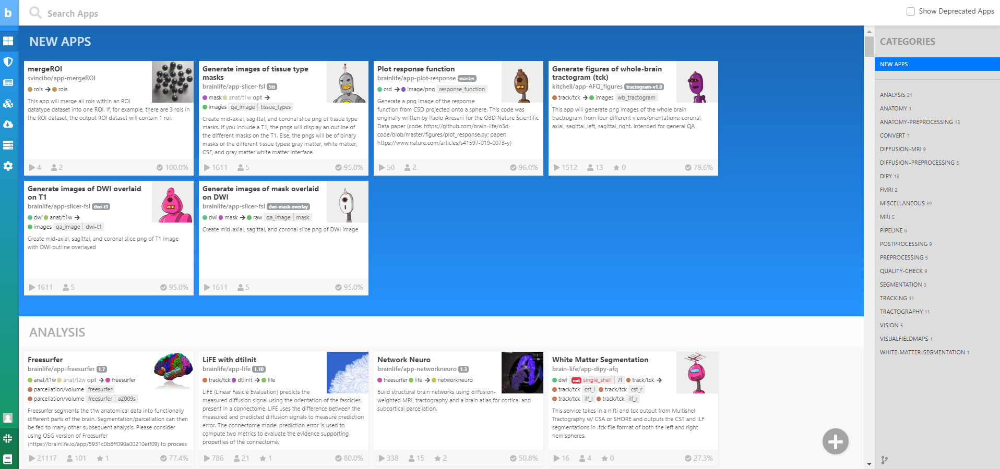

## Data Processing

Now that we understand `Apps`, we can practice some data processing on your project!

1. To start, open the `Processes` tab in your project -- this is where you will always submit Apps, which can share input-output data-objects. 

2. Create a new process by clicking the `+` button you have now become so familiar with. This time, you will find it in the panel on the left-hand side of the `Processes` tab. Enter a name for your process and hit "OK." 

3. Nice! In order to process the data, you first need to stage data from your `Archive` to your process. Each process can only process data that is either staged or generated by other Apps. You can find the `Stage New Data` button on the bottom of the screen, click it.

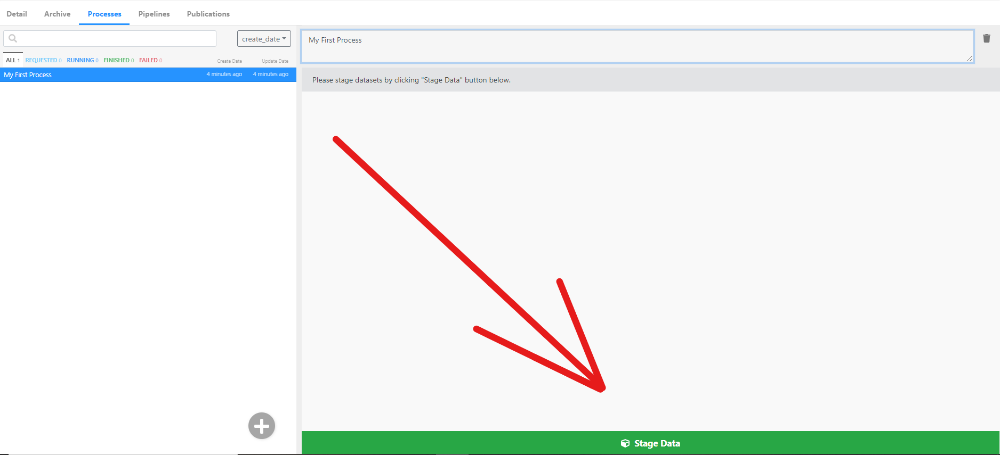

4. Then select a project (we used `Brainlife demo` and you can too) and choose any `anat/t1w` data-object.

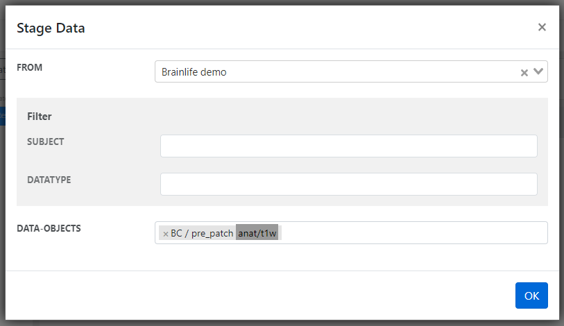

5. Once you have staged your data-object, you can submit an App. Click the `Submit New App` button (it is to the left of the `Stage Data` button). 

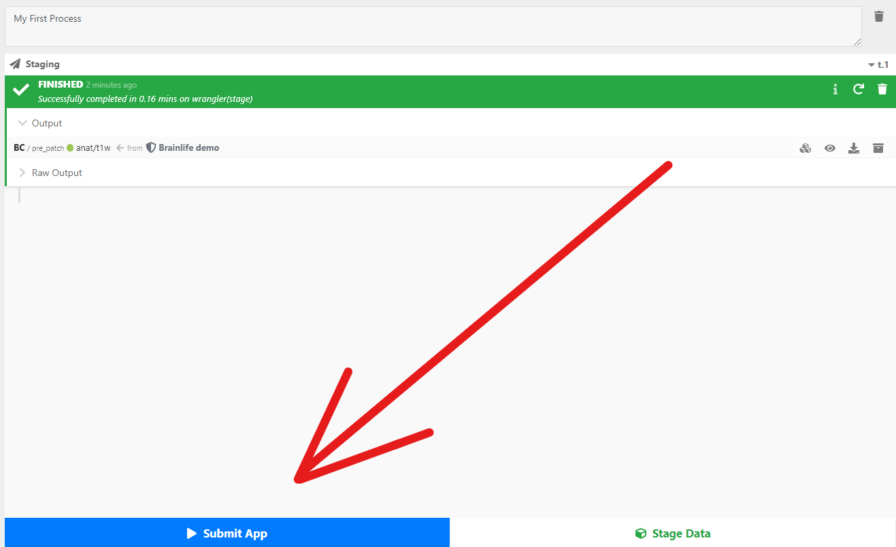

6. You will see a list of Apps that you can submit using your `anat/t1w` data-object. brainlife.io only allows you to select the Apps where you have all required input data, so do not worry if you are unsure. A good App to practice with is `ACPC alignment via ART`, so let's use that one!

7. Find and click `ACPC alignment via ART`. Your staged data should automatically be selected as the input. All you need to do now is hit `Submit`. 

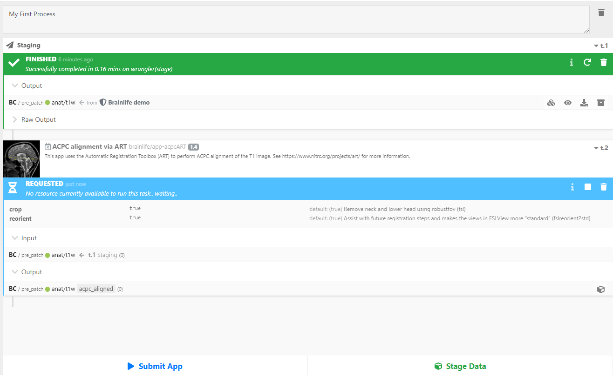

As you see above, brainlife.io automatically searches for and selects the best resource to run your App. brainlife.io will transfer data to the resource and submit it to the local batch scheduler. The task should not take too long to run. 

Once it is completed, your successful App submission will look like this:

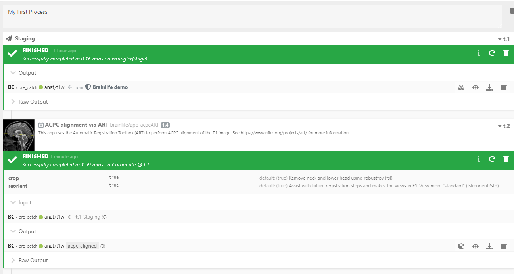

8. **You DID IT!** You can browse and download any output files as they are generated under the `Raw Output` section. Do you want to visualize it? Launch the visualization tool by clicking the :fa-eye: button next to the `Output` section of your executed App. 

9. Open `Volume Viewer` to see it.

10. And for fun -- click the:fa-eye: button next to the `Output` section of staged data to compare data that has not yet been ACPC-aligned to the data we ran with the `ACPC alignment via ART` App.

11. Check out the before and after images of the original output data vs. the output data with ACPC alignment. The bottom image is clearly better aligned and re-positioned at the ACPC line. That is because `ACPC alignment via ART` is a common alignment tool used to re-orient and re-position the brain image in common orientations better-suited for image analysis. For more info on ACPC alignment [go here](https://github.com/vistalab/vistasoft/wiki/ACPC-alignment).

**Bonus**: Now that you have finished running ACPC alignment, you will find that you can submit a few more Apps than you could before. Go have fun and try them out! 

!!! hint
    If you are not sure which data to stage, go to the [Apps page](https://brainlife.io/apps) to see which datatype each App requires to run.

## Archiving

So far, you have staged data, submitted an App that generated data derivatives, and visualized them. Nice work!

We should now talk about how to archive these processes. All processes are meant to be temporary, and brainlife.io will remove processes within 25 days of data generation (some resources have a shorter data purging policy). 

If you want to permanently keep the output data you generated, you will need to `Archive` the output by clicking on the :fa-archive: button in the Output section (it is in the same section as the eyeball). You can edit any metadata and the description, and then archive the data. Double-check that your data is now listed under the `Archive` tab, where you can click on the data-object record to see more details.

* **Data Provenance**

    As you submit more Apps and generate data from them, it becomes harder to keep track of how the data is generated. brainlife.io keeps a record of how each data-object was generated for you (called `data provenance`).

    To see this record, go to the `Archive` tab and select the data-object you just archived. Click the `Provenance` tab.

    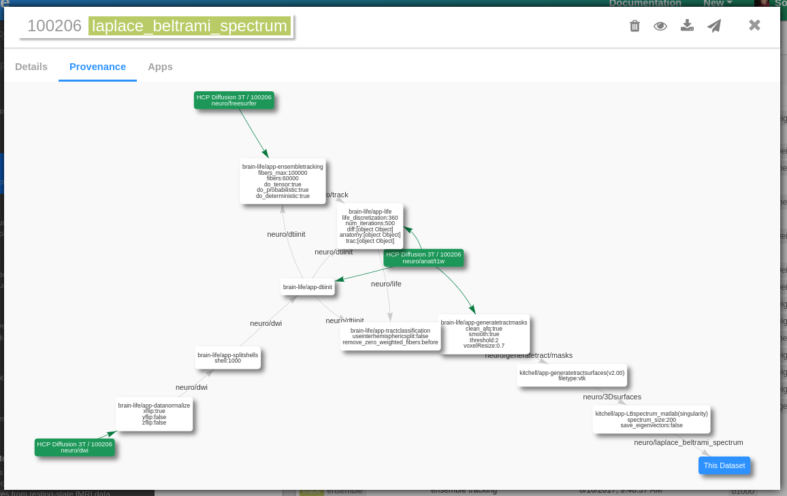

    The green box represents the original input data-object uploaded to brainlife.io and the white box shows the App run to generate the data derivatives. You can move around and zoom in and out on the diagram or edit the layout of items by dragging and dropping.

## What's Next?

You have just become familiar with all the basic functionalities of brainlife.io. We are proud of you! So what's next?

* Learn how to write and register an App on brainlife.io: [App Developer Guide](/docs/apps/introduction)
* Learn how to bulk process multiple subjects: [Pipeline documentation](/docs/user/pipeline)
* Or just keep moving down the documentation pipeline with the next section: [Projects](https://brainlife.io/docs/user/project/)

Be sure to [let us know](mailto: brlife@iu.edu) how we can improve this tutorial for you, or send us pull requests with your edits!
