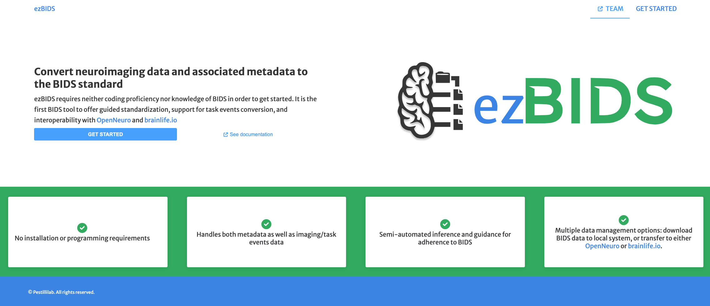
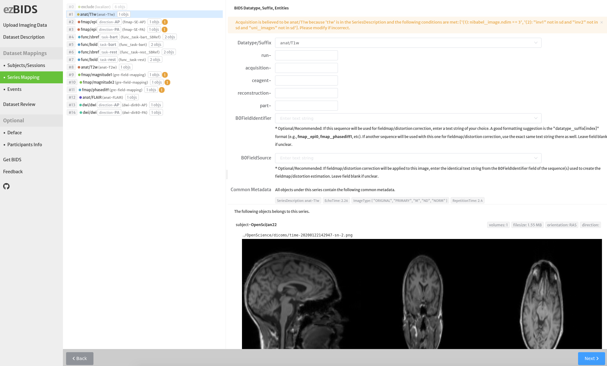
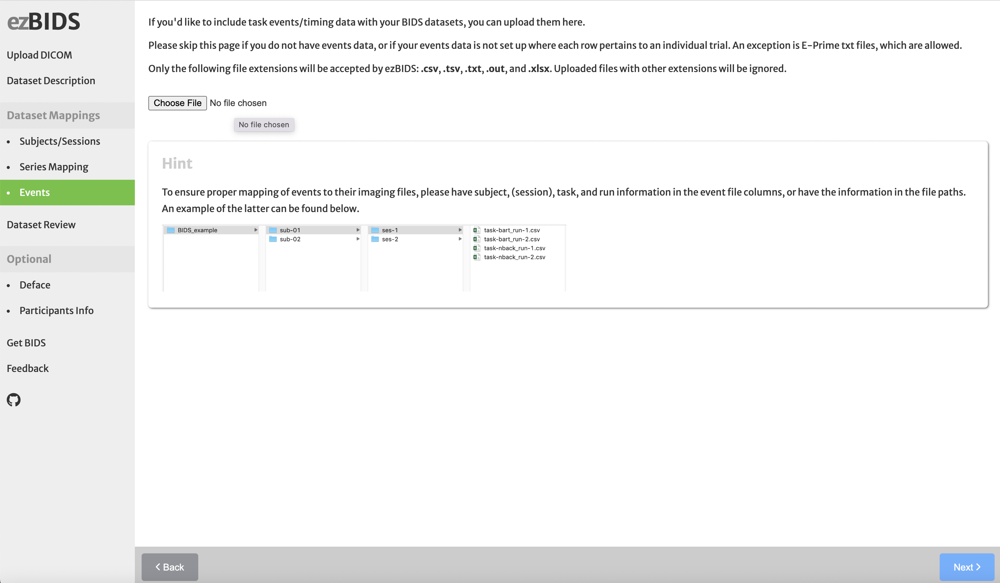
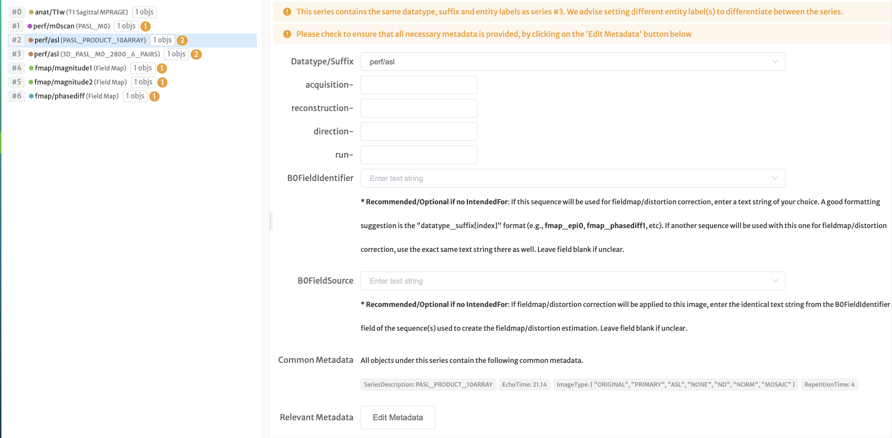
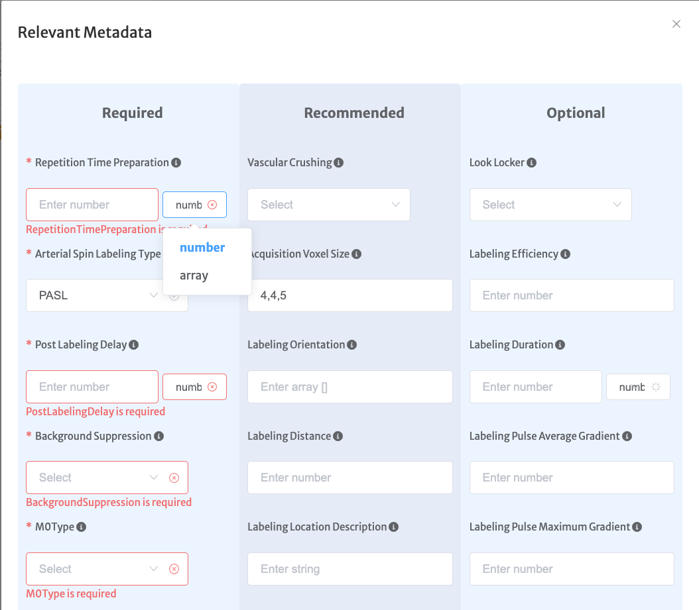

# **ezBIDS User Documentation**

[ezBIDS](https://brainlife.io/ezbids) is a web-based BIDS conversion tool that requires neither installation, programming proficiency, nor knowledge of the Unix terminal and BIDS specification. The term BIDS is an acronym that stands for the [Brain Imaging Data Structure](https://bids-specification.readthedocs.io/en/stable/). More specifically, BIDS is a format for describing and organizing (primarily neuroimaging) data, greatly enhancing data sharing within the scientific community, as well as enabling access to a suite of processing and analysis tools that can be automatically executed on BIDS data, known as [BIDS apps](https://bids-apps.neuroimaging.io/). This tutorial describes how to use ezBIDS to easily convert imaging data to BIDS.

## A Primer to ezBIDS

The process of converting raw imaging data to BIDS is often time-consuming and can require substantial technical expertise. Fortunately, there exist many open-source tools to aid researchers in this process. For a thorough list of BIDS conversion tools, see [official BIDS standard website](https://github.com/rordenlab/dcm2niix#links) and [this is another helpful page](https://bids.neuroimaging.io/benefits.html#mri-and-pet-converters). 

ezBIDS provides unique features that differentiate the tool from others:
1. No installation or programming required. It works in your web browser.
2. Semi-automated inference and guidance for BIDS adherence. It makes educated guesses about how your data should be mapped into BIDS and proposes both initial BIDS mapping of your data and warnings on the things that might need your attention.
3. Conversion of task event/timing files associated with functional BOLD (`func/bold`) sequences. If you have collected data using a task ezBIDS will help you map your tasks events into BIDS.
4. Multiple data management options:
    1. Download BIDS-converted data to a local computer or server.
    2. Push BIDS-converted data to open-science archives and platforms, such as [OpenNeuro](https://openneuro.org/) and [brainlife.io](https://brainlife.io/about/).

Think about [ezBIDS](https://brainlife.io/ezbids) as a small, smart, decision support system. ezBIDS attempts to do the heavy lifting for users, interpreting the necessary descriptions of the data uploaded and mapping these descriptions to the corresponding BIDS descriptions. Critically, however, users have the ability to edit (or modify) the BIDS dataset created by ezBIDS. Using the ezBIDS graphical interface users can make sure that the BIDS dataset created is appropriate and looks like the user wants it. 

## ezBIDS Walkthrough

### 1. Upload Imaging Data

Upon reaching the [ezBIDS](https://brainlife.io/ezbids) homepage, users are guided through several steps (i.e., web pages) to ensure that data are accurately described, organized, pseudonymized, and, ultimately, converted. These steps are described below:

For ezBIDS to access users' imaging data, the data must first be uploaded to ezBIDS's secure and encrypted server (ezBIDS runs on a secure VM running on the HIPAA-aligned National Science Foundation's [Jetstream-Cloud](https://jetstream-cloud.org/)). There are two accepted upload methods:
1. **Raw DICOM data** from the scanner or imaging device.
2. **NIfTI/JSON data** converted from DICOMs using [dcm2niix](https://github.com/rordenlab/dcm2niix). If using this option, it is best if the [most recent](https://github.com/rordenlab/dcm2niix/releases) dcm2niix version was used. 

!!! warning
    Uploaded data can only be accessed through the unique URL with your session ID. Also, uploaded data are purged from the ezBIDS system after 5 days.

ezBIDS prefers that non-anonymized data are uploaded (e.g. with the `-ba y` flag option in dcm2niix), as this makes it easier to discern the subject (and session, if applicable) mapping of the data and doesn’t require organizing the raw data in any specific manner. When non-anonymized, the data contains important metadata information such as the *AcquisitionDateTime*, *PatientName*, and *PatientID*, which help inform ezBIDS of the subject and session mappings. If however anonymized data are uploaded, which do not contain this metadata information, users will need to organize their data such that data from individual subject (and session) scans are in separate folders. To improve performance, these folder names should explicitly specify the subject (and session, if applicable) IDs desired (e.g., `sub-001`, `sub-001_ses-pre`, etc.). Users are not required to adhere to this naming convention, however, in such cases, ezBIDS will simply use the folder(s) name(s) as a placeholder for the subject (and session) IDs.

!!! note Non-anonymized Data
    If non-anonymized data are provided, ezBIDS will eventually anonymize the data (i.e., remove identifying metadata) before converting to BIDS.

Users may upload compressed imaging data using formats such as *.tar.xz*, *.tar*, *.tgz*, *.gz*, *.7z*, *.bz2*, *.zip*, and *.rar*.

Once data are uploaded, ezBIDS performs several backend operations to gather and identify as much relevant BIDS information as possible, as well as general information to help users see what data they’re examining (e.g., image screenshots, metadata, etc.). All this information is then presented to users on the subsequent pages. Users may then edit or modify BIDS-specific information as they so choose. 

!!! info Upload Speed and Time
    The amount of time to upload data will depend on the size of the data being uploaded and the speed of the internet connection. 
    
ezBIDS has been primarily tested on the Chrome and Firefox browsers; it is preferable that one of these browsers be used. 

### 2. Dataset Description

This page allows users to provide general information regarding their dataset, such as authors, funding sources, etc. 

Users only need to provide information here the first time using ezBIDS with data from a new dataset. When using ezBIDS with newly acquired data from the same dataset as before, this information is already provided and is therefore redundant to specify again.

!!! warning Progress checks
    For this and subsequent ezBIDS web pages, certain information is required by BIDS, indicated on each page with a red asterisk or circle. These fields must be entered, otherwise, users will be unable to progress to the next page. This provides users with real-time assistance on what information is required in order to have BIDS-compliant data, rather than going through the entire process only to learn afterward that there is an issue to resolve. 

### 3. Subjects and Sessions

On this page, ezBIDS provides the subject (and session, if applicable) IDs of the uploaded data. Users may edit or modify these fields as they see fit. This can either be done manually or by selecting an option within the "Reset Subject Mapping" button.

### 4. Grouping data 

ezBIDS organizes all uploaded data into specific series and group IDs. This is an intermediate step, that ezBIDS uses to facilitate editing entire series (or groups) of data files. Say, you want to change all the files from a single subject so that all the files start with a specific subject ID, or say you want to change all the data that are anatomical to start with the prefix *anat*, ezBIDS allows you to that by grouping data for you by subjects, series, etc. 

!!! info ezBIDS makes educated guesses about your data using information saved in the DICOM files
    ezBIDS uses the DICOM fields *Series Description*, *Image Type*, *Echo Time*, and *Repetition Time* to group data together. This means that ezBIDS assumes that data with the matching values in these fields are part of the same series of data. ezBIDS then matches the Series to the corresponding [BIDS entities](https://bids-specification.readthedocs.io/en/stable/appendices/entities.html).
    
This grouping procedure saves users' time by serving files that might need to undergo similar changes in groups. ezBIDS provides warning messages (yellow circle and asterisk) to explain how the data were grouped. If this is incorrect and needs fixing, users can modify the groups using the graphical interface. If ezBIDS fails to group some of the data files, it will default to exclude the files, indicating that the files will not be converted to BIDS. Users may adjust this if necessary (or even mark data files not excluded by exBIDS as 'to be excluded', e.g., localizer sequences). 
    
If a BIDS entity label is required but ezBIDS is not able to guess it for the user, the tool alerts the users with an error (red circle and asterisk). Whereas warnings do not need to be addressed errors must be addressed before being able to move to the next page. 

### 5. Events

A critical feature of ezBIDS is the ability to support tasks and event files. If users collected functional BOLD (`func/bold`) data and have the corresponding timing files. The following are timing files formats compatible with ezBIDS:  `.csv`, `.tsv`, `.txt`, `.out`, and `.xlsx`. A graphical interface guides the user in matching the files to BIDS structures. Importantly, ezBIDS comes with a beta feature and built-in compatibility with E-Prime files.

!!! warning 
    When uploading timing files, it is **crucial** that the following entity labels be explicitly specified: *subject*, (*session*, if applicable), *task*, and *run*. These must match the corresponding `func/bold` sequences. This information can either be provided in the file path or as columns in the timing data themselves. Failure to do so will result in ezBIDS creating a placeholder value for any mismatched entity labels that will later require manual intervention. 

!!! info ezBIDS assists users in dealing with timing events and units
    BIDS requires that timing files be translated into *events.tsv* format, with several required and optional columns. Required columns include the *onset* and *duration*. ezBIDS has the ability to assist users in cases where uploaded timing files do not have a column that specifically pertains to *onset* and *duration*. For example, rather than a column specifying trial durations, a file might contain a column for trial_onset and another column for trial_offset. Users can specify an arithmetic method (Subtract, Add) and choose the two columns that when subtracted or added create the duration value. It should be noted that this arithmetic approach only applies to event columns involving time-based values. Additionally, users can specify for timed-based columns whether the values are in seconds or milliseconds (BIDS requires that these values be reported in seconds).

!!! warning Timing files for different tasks
    Currently, ezBIDS can only handle timing files that have identical column names. In theory, users can upload timing files pertaining to different `func/bold` tasks, but only if all files contain identical column names. 

### 6. Dataset Review

Upon reaching this page, all individual imaging sequences are provided in the order they were collected for each subject’s (and session’s) scan. Here, users can make edits/modifications to individual files (e.g., set a sequence to `exclude` due to known participant motion, etc.) that were otherwise not possible when Grouping data.

All modifications made on the Series Mapping and Events pages are applied. ezBIDS applies a run entity label to sequences if there were multiple occurrences during the scan. 

!!! warning Functional data exclusion
    ezBIDS applies a volume threshold on 4D data (e.g., `func`/`bold`) to check for sequences that might have had to be restarted during the scan. The threshold is calculated based on the expected number of volumes collected during a 60-sec period, given the TR (`60/TR`). If a 4D sequence does not meet this threshold, ezBIDS sets the datatype/suffix pair to `exclude`, unless modified by the user.

### 7. Deface

Users have the option (recommended) to deface all anatomical images in order to further anonymize the data. ezBIDS provides two defacing procedures: [Quickshear](https://github.com/nipy/quickshear) and [pyDeface](https://github.com/poldracklab/pydeface). Depending on the number of anatomical files in the uploaded data, this process may take several minutes, though ezBIDS can parallelize this process with six concurrent defacing processes at a given time. If the defacing is suboptimal (i.e. defacing cuts into the brain itself), users may try again with the other defacing option or simply specify that they do not wish to deface the anatomical data.

### 8. Participants Info

For each subject ID specified, users may specify phenotypical information pertaining to each participant. By default, ezBIDS attempts to provide the *sex* and *age* of participants if this information is present in the metadata (typically only specified if non-anonymized data are uploaded). Users may add additional columns (e.g., *handedness*) or delete existing columns.

### 9. Get BIDS

At this stage, users can click on the green "Finalize" button for ezBIDS to apply all user edits/modifications to create a BIDS-compliant dataset. Users may elect to keep any data that was set to “exclude” if they so choose.

Once complete, two screens are presented. On the left is a Linux tree structure showing the BIDS dataset organization and file names. On the right is a screen output of the [bids-validator](https://bids-standard.github.io/bids-validator/), which provides a final check to ensure that the data are BIDS compliant. Any validator warnings appear in yellow and can be ignored (but are good to resolve later), and errors appear in red, indicating that the dataset is not BIDS-compliant for some specified reason and requires correction. If users need or wish to return to previous pages for additional edits/modifications they may do so. Then, upon returning to this page, users must click the green "Rerun Finalize Step" to apply all new changes. 

Once a BIDS-compliant dataset is generated, users can click on the blue "Get BIDS" button to download their zipped data to their local computer/server, and/or send their BIDS data to [OpenNeuro](https://openneuro.org/) or [brainlife.io](https://brainlife.io/about/). 

!!! info Using ezBIDS Templates for repeated sessions for a single study (across subjects)
    After completing a BIDS mapping, ezBIDS automatically creates a Template (JSON) file that details all information and changes made during the ezBIDS session. This template can be uploaded with subsequent subjects in a study, or sessions of the same subjects and study. Using templates reduces the time spent editing the BIDS structure on subsequent uploads of DICOMs from the same scan session types. See below for more information.

Once ezBIDS has converted uploaded data to BIDS, users have the option to download a configuration/template file (*finalized.json*), which contains all information, including user edits/modifications, from the ezBIDS session. When this file is uploaded with subsequent data (of the same dataset), the information in the configuration file is applied to the current ezBIDS session, reducing future time spent on future edits/modifications. The information from the configuration file is applied on the following pages:

1. **Dataset Description** - Any information here is automatically generated.
2. **Subjects/Sessions** - ezBIDS will attempt to determine the new subject ID(s) and session ID(s), though this depends on how easily ezBIDS could determine this information, and may still require edit(s).
3. **Series Mapping** - All edits made during the first use are applied here.
4. **Events** - If timing files associated with `func/bold` sequences were uploaded in previous and current ezBIDS sessions, the *events.tsv* column mappings are applied to the current timing file(s) data.
5. **Participants Info** - Any newly specified columns (e.g., *handedness*) are applied here as well. 

If new/different data is uploaded which was not present in the previous upload, ezBIDS will proceed as usual. The configuration also enables many-to-one or one-to-many mapping, meaning that the *finalized.json* information can pertain to a single subject but be applied to a current upload with multiple subejcts/sessions. The *finalized.json* file can be renamed if desired, however it needs to end in "finalized.json" in order for ezBIDS to know what to look for. 

!!! note
    Uploading a *finalized.json* file does not mean that ezBIDS runs automatically from start to finish. When converting data to BIDS, user approval is judicious.

### 2. Specify and save metadata into BIDS sidecar (JSON) file(s)
As the BIDS specification expands to include additional imaging modalities, specific metadata are required for BIDS compliance but not extracted by the [dcm2niix](https://github.com/rordenlab/dcm2niix) package, a tool commonly used by BIDS converters to extract relevant metadata. ezBIDS thus provides users the ability to specify missing metadata fields, which are then injected into the JSON sidecar(s). 

!!! note
    This functionality is currently in the beta stage and is only accessible for Arterial Spin Labeling (ASL) data. In the coming months, this functionality will be expanded to include non-MRI modality data, such as Positron Emission Tomography (PET).

This functionality is currently found on the Series Mapping page.

<table><tr><td>
    
</td></tr></table>
 

For any ASL sequence (e.g, `perf/asl`, `perf/m0scan`), on the right side of the page there is a "Relevant Metadata" section with an "Edit Metadata" button. Upon clicking this button, a list of relevant metadata is provided.

<table><tr><td>
    
</td></tr></table>
 

The relevant metadata are organized into Required, Recommended, and Optional columns, denoting their presence requirement level, per the BIDS-specification. Users are alerted to all Required metadata fields, needed for a BIDS-compliant dataset that generates no [bids-validator](https://github.com/bids-standard/bids-validator) errors. For certain metadata fields (e.g., `RepetitionTimePreparation`), multiple value types are allowable (e.g., number, array). Users should specify this before entering the metadata value. ezBIDS performs an internal quality assurance to ensure that the value entered correctly matches the type. For example, if a user specifies a string value for a numeric value metadata field, ezBIDS will generate a error to alert the user. ezBIDS also handles conditional situations, where the requirement level of specific metadata fields changes based on the presence or specific value of a separate metadata field. For example, if `BolusCutOffFlag` is set to `True` then ezBIDS will alert you that the metadata fields `BolusCutOffDelayTime` and `BolusCutOffTechnique` are now Required. Once all edits are made, users scroll to the bottom and click the "Submit" button. This will then inject the metadata fields & values into the corresponding sidecar(s).

Although ezBIDS alerts users to any and all metadata fields that are Required, users may still click the "Submit" button even if all Required fields are not specified. This will inevitably lead to errors when the bids-validator is executed; however, this prevents forcing users to enter all information,particularily if certain metadata field values are unknown at that moment. Any fields specified are still injected into the sidecar(s), and missing Required metadata fields can be specified manually by the user at a later time.

### 3. dcm2niix error alerts

ezBIDS, like most BIDS converters, users [dcm2niix](https://github.com/rordenlab/dcm2niix) to convert DICOM files to NIfTI and JSON (and bval/bvec) formatted files. These files are required by BIDS and used by many MRI processing & analysis tools. If dcm2niix generates an error for a specific or series of DICOMS during this conversion process, ezBIDS will display the message for users.

<table><tr><td>
    
</td></tr></table>
 

It is recommended that users open an issue on the dcm2niix [issues page](https://github.com/rordenlab/dcm2niix/issues) to resolve any detected dcm2niix errors. However, users may still proceed with ezBIDS, as the error does not pertain to the entire uploaded data but rather a specific DICOM file(s). It should be noted though that the offending file(s) might result in an improper or corrupted NIfTI file that doesn't properly convert to BIDS. 

### 4. Visualizing Imaging data

### 5. Installable versions of ezBIDS

In the coming months, an installable version of ezBIDS will be made available through Singularity, further negating the need for data upload. With this, data will instead be accessible locally. This is currently possible on a Docker-enabled machine with docker-compose installed; however, most university and institution HPCs only allow Singularity but not Docker, due to root access issues. Given that many researchers store their large neuroimaging data on an HPC, ezBIDS will soon provide a Singularity installable version to compliment currently available Docker installable. 

!!! info ezBIDS Configuration Templates
    ezBIDS creates templates for scanning sessions. Any scanning session processed using ezBIDS can become a template for future sessions. ezBIDS Templates can be reused to automatically load the BIDS mapping configuration a user has identified. Templates are helpful in the common situation where the same scanning protocol is used for multiple sessions. Often, researchers set up a scanning protocol and configure a series of scans to be acquired on multiple subjects across the duration of a research project. When the scans from the first subject are uploaded and processed via ezBIDS the researcher is effectively creating an ezBIDS Template, automatically. ezBIDS Templates are JSON files created every time a dataset is processed via ezBIDS. To use the template all the user has to do is download the template and upload the template with any new sessions acquired in the future. ezBIDS Templates can be reused for any number of datasets and reduce users' interaction with the ezBIDS graphical interface. More specifically, after ezBIDS has converted a dataset to BIDS, users have the option to download the file `ezBIDS_template.json`. This file contains all information, to map the DICOMs to BIDS, including user edits and modifications, from the ezBIDS session. This file can be uploaded with new datasets. When done so, the information in the file is applied to the new ezBIDS session, all the graphical interface fields are loaded with the information initially set by the user, reducing time spent on edits. If a dataset is uploaded with the wrong template, or if the template needs to be modified, the user has the option to overwrite the template uploaded and use ezBIDS as usual via the graphical interface. The configuration also enables many-to-one or one-to-many mapping, meaning that the `ezBIDS_template.json` information can pertain to a single subject but be applied to a current upload with multiple subjects or even sessions. The `ezBIDS_template.json` file can be renamed if desired, however, it needs to end in `ezBIDS_template.json` in order for ezBIDS to know what to look for. Uploading an `ezBIDS_template.json` file will not let ezBIDS run automatically from start to finish, the user's review and approval are judicious.

    

    It is recommended that users open an issue on the dcm2niix [issues page](https://github.com/rordenlab/dcm2niix/issues) to resolve any detected dcm2niix-specific errors. However, users may still proceed with ezBIDS, as the error does not pertain to the entire uploaded data but rather a specific DICOM file(s). It should be noted though that the offending file(s) might result in an improper or corrupted NIfTI file that doesn't properly convert to BIDS. 

!!! info ezBIDS and data visualization
    ezBIDS uses [NiiVue](https://github.com/niivue/niivue) to visualize data. *NiiVue* is a web-based visualization tool for neuroimaging that can run on any operating system and any web device (phone, tablet, computer). On each image screenshot, users may click on the "NiiVue" button to open NiiVue and view their data.
